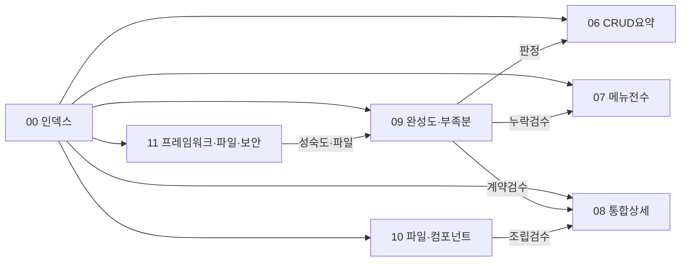

# HACCP 통합 완성도 · 잘된 점 · 부족한 점

> 정본: `16_통합완성도_및_부족분.md`  
> 작성일: 2026-08-10 · 개발자: 박승우  
> 목적: 나중에 docs를 **통합 리뷰**할 때 “뭐가 됐고 / 뭐가 부족한지” 판정 근거.  
> 상세 표·URL: [`07`](14_메뉴_화면_API_DB_전수.md) · [`08`](15_HACCP_FE_BE_통합_상세스펙.md) · 요약 갭: [`06`](13_업무_CRUD_BE.md) · 소스 지도: [`10`](17_파일구조_컴포넌트_함수지도.md) · 프레임워크·파일·보안: [`11`](18_프레임워크_파일_보안_작성규칙.md) · 운영·인증: [`01`](4_운영규칙_BE.md)·[`04`](10_인증_보안_JWT_BE.md)

판정 기호:

| 기호 | 의미 |
|------|------|
| 완료 | FE·BE·DB·메뉴가 한 줄로 이어지고 업무 사용 가능 |
| 부분 | 연결은 되나 검증·UX·운영 의존이 남음 |
| 부족 | 의도·스펙 대비 구멍 (리뷰 필수) |
| 동결 | 의도적 미구현·메뉴 숨김 (버그로 보지 않음) |
| 잔존 | API/코드는 있으나 UI·메뉴 없음 (정리 후보) |

---

## 1. 한눈에 보는 통합 완성도

| 영역 | 판정 | 한 줄 |
|------|------|--------|
| 로그인·JWT·권한 5종·사이드 메뉴 | 완료 | 아이디 로그인 · role_screen · menu/list |
| IA 5대메뉴 + today-tasks | 완료 | migrate 36 정본 |
| 시스템 관리 CRUD·이력 | 완료 | sys 8화면 폴더(user·department·role·menu·commoncode·loginhistory·auditlog·screenusage) · api/sys/* |
| 기초정보 마스터 | 완료 | MasterDataPage · bas/{type} |
| CCP 냉장 모니터링 | 완료 | 기준 밀도 (다른 CCP의 골드) |
| CCP 금속·검증 | 부분 | CcpFormPage 연결, 냉장 대비 검증 밀도 낮음 |
| CCP 가열·멸균·여과 | 부분 | generic-monitor, 양식별 업무검증 잔여 |
| 위생 일일·방충 DB | 부분 | Hygiene 연결, 냉장 미만 |
| 시설점검 DB (tmpl_prp-facility-check) | 부분 | BizOps 연결 |
| HWP leaf 27종 | 부분 | 공용 Editor 연결 · rhwp/CLI·서명 환경 의존 |
| 문서함·결재함·상신/검토 | 완료 | 작성=상신·취소 / 결재함=검토·승인·반려 |
| 결재·변경이력 화면 | 부족 | FE 있음 · DEMO 메뉴 leaf 없을 수 있음 |
| 법적서류 M-D | 완료 | 유형+문서 · 템플릿/첨부 · download indigo |
| 건강진단 그리드 | 완료 | health-cert API·첨부 |
| 설비·방충 이력 M-D | 완료 | 구 마스터 메뉴→history 통합 |
| 문서별 MFRM admin | 완료 | 점검항목·CCP한계 admin |
| 범용 점검항목관리 | 동결 | use_yn=N · 문서별 admin으로 대체 |
| 작성주기·결재선 | 완료 | workflow schedule/approval-lines |
| HWP 양식관리 | 부분 | 업로드·목록 OK · 환경·원본 경로 이슈 여지 |
| 오늘 할 일·알림 | 부분 | KPI·목록 OK · 과제 생성은 Job/로그인 보정 의존 |
| UV/PV 수집 | 완료 | useViewLog → collect |
| UV/PV 통계 화면 | 부분 | Job·수동집계 없으면 표 빔 (Job 추가됨, 운영 cron 확인 필요) |
| 스마트일지 UI | 동결 | API 잔존 |
| 감사추출 UI | 동결 | API 잔존 |
| 법적서류 인페이지 미리보기 | 동결 | G-25 · 다운로드만 ([`11` §2.9](18_프레임워크_파일_보안_작성규칙.md)) |
| ERP·바코드·PDF 제품화 | 동결 | 의도적 미범위 (rhwp PDF는 도구 의존) |

---

## 2. 잘된 점 (통합이 탄탄한 곳)

### 2.1 아키텍처·규약

| 항목 | 근거 |
|------|------|
| FE 화면코드 = DB scrn_cd = 레지스트리 키 | `screenRegistry` · `tbl_screen` |
| 테넌트 경계 | co_cd/user_id 본문 금지 · LoginUserContext |
| 삭제 표준 OPS_DELETE | validate-delete → delete · 복합키 배열 · BE 더블체크 |
| 타임아웃 3계층 FE | http / httpBatch / httpFile + envConfig |
| 에러 분리 | 사용자 업무문구 / 서버 로그 기술상세 |
| 인수인계 주석 밀도 | FE JSX prop · BE 파라미터·SQL 동일 정책 |
| MES와 프로세스 분리 | 포트·DB·패키지 완전 분리 |

### 2.2 업무 코어 루프

| 항목 | 근거 |
|------|------|
| 작성 → 상신 → 결재함 → 문서함 | DocumentApprovalToolbar 역할 분리 |
| deep-link `?docIdx=` | documentNav · 작성 화면 복귀 |
| HWP leaf 1 tmpl : 1 scrn | hwpLeaf(fixedTmplCd) · migrate 37 |
| 결재 SP 정본 | 15 + migrate 33 (TMP/28 덮어쓰기 금지) |
| 목록 검색 6인자 | doc_no · writer (14/19/20 + 30) |

### 2.3 최근 보강으로 닫힌 구멍

| 항목 | 조치 |
|------|------|
| UV/PV 통계 빈 화면 | ViewStatDailyJob + SP 집계 · formUrl 빈 LAW 400 가드 |
| 법적서류 UX | 좌·우 M-D · CRUD 패널화 · 셸 상단 CRUD 제거 · download 색 |
| 범용 점검항목관리 혼선 | 메뉴 N · 문서별 admin만 |
| 설비/방충 이중 화면 | History M-D로 통합 · 구 화면 N |

### 2.4 문서화

| 항목 | 파일 |
|------|------|
| 메뉴 전수 | 07 |
| FE↔BE 호출 체인 | 08 |
| 본 완성도·부족분 | 09 |
| 인덱스·합본 절차 | 00 |

---

## 3. 부족한 점 (리뷰 필수 · 우선순위)

### 3.1 P0 — 운영·데모에서 바로 티가 남

| ID | 부족 | 현상 | 권장 |
|----|------|------|------|
| G-01 | ~~`approval-history` 메뉴~~ | FE·API 있는데 DEMO `tbl_menu` 활성 leaf 없을 수 있음 | **완료 (마이그레이션 49로 복구)** — 2026-08-10 STEP 03. 화면 APR/230 · MAPR 부모 · leaf · ADMIN 권한을 ON CONFLICT DO UPDATE로 수렴 |
| G-02 | ~~UV/PV 통계 운영 의존~~ | Job cron·타임존·기동 옵션 미설정 시 표 공백 | **완료** — 2026-08-10 STEP 05. 런북 §6.2 체크리스트 · §7.2 과거 일자 재집계 SQL |
| G-03 | ~~migrate `47` 파일 2개~~ | `47_migrate_check_item_admin_crud` · `47_migrate_legal_upload_type` 번호 충돌 | **완료 (48로 이동)** — 2026-08-10 STEP 02. 두 파일은 참조 객체가 겹치지 않아 legal을 뒤로 옮겼다 |
| G-04 | ~~HWP/PDF 환경~~ | `APP_RHWP_CLI_PATH`·폰트·볼륨 없으면 export-pdf·미리보기 실패 | **완료** — 2026-08-10 STEP 05·09. 런북 §6.2·§11. `install_rhwp.sh`로 v0.8.2 리눅스 바이너리 볼륨 설치·SHA256 검증·컨테이너 안 `export-pdf` 실변환(70KB) 확인 |
| G-05 | ~~양식 form_path 공백~~ | LAW 등 유형만 있고 파일 없으면 form GET 400 (FE 가드는 됨) | **완료** — 2026-08-10 STEP 04. 400 → 404(`NotFoundException`) · BE/FE 문구 통일 · 버튼 툴팁 · arraybuffer 오류 파싱 |

### 3.2 P1 — 기능은 되나 완성도·정리 부족

| ID | 부족 | 현상 | 권장 |
|----|------|------|------|
| G-10 | ~~CCP/위생/BizOps 검증 밀도~~ | 냉장 대비 스모크·엣지 문서·테스트 부족 | **완료(문서)** — 2026-08-10 STEP 06. [`13_스모크_매트릭스.md`](19_스모크_매트릭스.md) 표1. 실행은 수동 표 + `prod_smoke.sh` |
| G-11 | ~~HWP 27 leaf 균일 검증~~ | 공용 Editor만 믿고 leaf별 편차 | **완료(문서)** — 2026-08-10 STEP 06. 13 표2(샘플 5실측·22 목록). 실행은 배포 후 수동 |
| G-12 | 오늘 할 일 Job 의존 | 00:05 Job·로그인 보정 없으면 과제 공백 | 기동/로그인 generate 경로 문서화 |
| G-13 | dead API/코드 | ~~`ccpMetalApi`·`ccpVerificationApi` · MasterData equipment/pest config~~ | **완료** — Wave-A: deprecate 없이 즉시 삭제 완료 (2026-08-10, STEP 01). `DocumentBoxPage.approvalMode`도 함께 제거 |
| G-14 | ~~잔존 API (동결 UI)~~ | smart-diary-* · audit-export | **완료** — 2026-08-11 STEP 20. smart-diary FE/BE API **폐기**(DB DROP은 별도 승인). audit-export **동결 유지**(`@Deprecated`, FE 미노출). audit-log 화면은 미변경 |
| G-15 | ~~BizOps 다중 base~~ | fac/inv/prc URL은 있는데 작성 UI는 HWP로 이전된 화면 다수 | **완료(문서)** — 2026-08-11 STEP 23. [`08` §5.7](15_HACCP_FE_BE_통합_상세스펙.md)·[`07` §6.4](14_메뉴_화면_API_DB_전수.md). 활성 BizOps UI=`facility-equipment-check`만 · HWP 이관 4종 `bizOpsApi` 호출 0. API 삭제는 별도 승인 |
| G-16 | ~~문서 06 vs 09~~ | 06의 완료표와 09가 일부 중복·시점 차이 | **완료** — 2026-08-11 STEP 21. 06은 요약·링크만 · 판정은 09 유일 정본 · 00 합본 규칙 명시 |

### 3.3 P2 — 품질·운영·문서 부채

| ID | 부족 | 현상 | 권장 |
|----|------|------|------|
| G-20 | ~~FE docs만 상세, BE docs는 06 요약~~ | 통합 리뷰 시 BE 전수는 08에 의존 | **완료** — 2026-08-11 STEP 22. BE [`2_문서인덱스_BE.md`](2_문서인덱스_BE.md)에 FE 08/09/11·런북 미러 링크 |
| G-21 | ~~E2E/자동화 테스트~~ | 핵심 루프 자동 테스트 부재 | **완료(상신 실측)** — 2026-08-11 STEP 28. Playwright `e2e/cold-request.spec.ts` 2 passed. Credentials `haccp-write-user`. **main Jenkins 미포함** · `Jenkinsfile.e2e` |
| G-22 | ~~멀티탭 로그아웃~~ | MES F174 대비 Path basename 갭·문서 부족 | **완료** — 2026-08-11 STEP 24. `authPaths`로 `/haccp/login` 정합 · [`08` §3.4](15_HACCP_FE_BE_통합_상세스펙.md)·[`04` §5.1](10_인증_보안_JWT_BE.md) · vitest `authPaths`/`authCrossTab` |
| G-23 | ~~그리드 pref·가상화~~ | env는 있으나 화면별 편차·PAGE_SIZE 미사용 혼동 | **완료** — 2026-08-11 STEP 25. [`08` §3.5](15_HACCP_FE_BE_통합_상세스펙.md)·스모크 §5.5. 활성=VIRTUAL_THRESHOLD · PAGE_SIZE는 예약. 문서함·감사로그·설비이력 경로 OK · 크리티컬 0 |
| G-24 | ~~서명 UX~~ | 클립보드·업로드 경로 환경 의존 | **완료(문서)** — 2026-08-11 STEP 26. [`11` §2.8](18_프레임워크_파일_보안_작성규칙.md) 등록·사용·실패 시 안내. 코드 변경 없음 |
| G-25 | ~~법적서류 PDF/HWP 혼재~~ | 미리보기 제거됨 · 다운로드만 | **동결(의도)** — 2026-08-11 STEP 27. [`11` §2.9](18_프레임워크_파일_보안_작성규칙.md). 인페이지 미리보기 재도입은 별도 제품 STEP · 코드 변경 없음 |
| G-26 | ~~CI 감시 자동화~~ | 버전 drift·OPS_DELETE·파일크기·문서링크 수동 | **완료** — 2026-08-10. `scripts/audit_*.sh` · `Jenkinsfile.audit` nightly (런북 §19) |

---

## 4. 영역별 상세 매트릭스

### 4.1 셸 · 공통

| 항목 | 판정 | 잘된 점 | 부족한 점 |
|------|------|---------|-----------|
| Login / JWT | 완료 | BCrypt·잠금·sid | — |
| Menu / isImplemented | 완료 | 미구현 비활성 | 메뉴≠레지스트리 갭(G-01) |
| usePageCommands | 완료 | 단축키·상단 툴바 | 법적서류는 의도적으로 search만 |
| useViewLog | 완료 | 배치 flush | 통계는 Job 필요(G-02) |
| pref grid | 완료 | list/save | — |
| 공통코드 | 완료 | code/list | — |

### 4.2 문서 작성 (MWRK)

| 항목 | 판정 | 잘된 점 | 부족한 점 |
|------|------|---------|-----------|
| 냉장 CCP | 완료 | 골드 | — |
| 금속·검증 | 부분 | API·화면 연결 | G-10 |
| 가열·멸균·여과 | 부분 | generic | G-10 |
| 일일·방충 | 부분 | Hygiene | G-10 |
| 시설점검 | 부분 | BizOps tmpl_prp-facility-check만 DB | ~~G-15~~(문서) · 스모크는 G-10 매트릭스 |
| 건강진단 | 완료 | 그리드·첨부 | — |
| 설비이력 | 완료 | M-D·사진 | — |
| HWP 27 | 부분 | 공용 Editor | G-04 · G-11 |
| 구 DB→HWP 전환 | 완료(메뉴) | leaf·doc_kind | 구 screen use_yn=N 확인됨 |

### 4.3 현황·결재 (MAPR)

| 항목 | 판정 | 잘된 점 | 부족한 점 |
|------|------|---------|-----------|
| 결재함 | 완료 | inbox API | — |
| 문서함 | 완료 | list·deep-link | — |
| 결재이력 | 완료 | FE mode=history | ~~G-01 메뉴~~ (migrate 49) |
| 법적서류 | 완료 | M-D·다운로드만 | ~~G-05~~ · ~~G-25~~(동결) |
| 개선조치 | 완료 | corrective API | — |

### 4.4 기준관리 (MFRM)

| 항목 | 판정 | 잘된 점 | 부족한 점 |
|------|------|---------|-----------|
| HWP문서관리 | 부분 | templates form | G-04 |
| 문서별 admin | 완료 | fixedTmplCd | — |
| CCP한계 admin | 완료 | MasterData 필터 | 범용 ccp-limit-management와 역할 중복 감수 |
| 작성주기·결재선 | 완료 | workflow | — |
| 방충/설비 이력 메뉴 | 완료 | scrn history | menu_cd 구명 잔존(가리키는 scrn은 history) |

### 4.5 기초·시스템

| 항목 | 판정 | 잘된 점 | 부족한 점 |
|------|------|---------|-----------|
| MCOD 마스터 | 완료 | CRUD·삭제검증 | — |
| MSYS CRUD | 완료 | — | — |
| 로그인/감사/UV 통계 | 부분~완료 | 조회 | UV는 G-02 |

### 4.6 DB · 배포

| 항목 | 판정 | 잘된 점 | 부족한 점 |
|------|------|---------|-----------|
| SP 규약 | 완료 | sp_tbl_* | — |
| IA migrate | 완료 | 36 | G-03 번호 |
| DEMO 시드 | 부분 | 41 | leaf 샘플 편차 G-11 |
| Docker/Nginx | 문서 분산 | `04-deploy` · `docs/20` | 배포 절은 런북 정본 |

---

## 5. FE·BE 정합 갭 (코드 냄새)

| 구분 | 내용 | 조치 후보 |
|------|------|-----------|
| ~~Dead FE path~~ | MasterDataPage 내 equipment/pest config | **완료** — 2026-08-10 STEP 01 삭제 |
| ~~Dead/중복 FE api~~ | ccpMetalApi · ccpVerificationApi | **완료** — 2026-08-10 STEP 01 삭제, `ccpFormsApi`로 통일 |
| ~~API 잔존 UI 없음~~ | smart-diary · audit-export | **완료** — STEP 20. smart-diary API 제거 · audit-export 동결 |
| menu_cd ≠ scrn_cd | MFRM equipment-management → equipment-history | 문서화됨 · 리네임은 선택 |
| 셸 CRUD vs 패널 CRUD | 법적서류 search만 | 의도 — 09에 명시 유지 |
| BE docs 얇음 | 루트 `docs/2_`·`4_`·`6_`·`8_`·`10_`·`13_` | 08·09 링크 (이미 일부) |

---

## 6. 리뷰 백로그 (통합 문서 작업용)

합본·리뷰 미팅에서 아래를 순서대로 닫는다.

### Must (P0)

1. ~~G-01 approval-history 메뉴 복구 여부 결정·적용~~ — 완료 (2026-08-10, STEP 03, migrate 49)  
2. ~~G-03 migrate 47 이중 번호 정리안~~ — 완료 (2026-08-10, STEP 02, legal을 48로 이동)  
3. ~~G-02 / G-04 운영 env 체크리스트를 08 또는 배포 문서에 고정~~ — 완료 (2026-08-10, STEP 05, 런북 §6·§7)  

### Should (P1)

4. ~~G-10 / G-11 스모크 매트릭스~~ — 완료(문서) (2026-08-10, STEP 06, [`13_스모크_매트릭스.md`](19_스모크_매트릭스.md))  
5. ~~G-13 dead code 정리 Wave~~ — 완료 (2026-08-10, STEP 01)  
6. ~~G-14 잔존 API 폐기/유지 결정~~ — 완료 (2026-08-11, STEP 20)  

### Could (P2)

7. G-21 E2E 스모크  
8. ~~06 내용을 09로 흡수하고 06은 “요약 1페이지”로 축소~~ — 완료 (STEP 21 / G-16)  
9. ~~BE docs에 08/09 미러 인덱스만 추가~~ — 완료 (STEP 22 / G-20, BE `00_문서인덱스.md`)  

---

## 7. “통합 잘됨” 판정 기준 (리뷰 합의용)

다음을 모두 만족하면 해당 화면/영역은 **완료**로 승격한다.

1. DEMO(또는 대상 테넌트) 메뉴에 leaf 있고 use_yn=Y  
2. SCREEN_REGISTRY 키 존재 · isImplemented true  
3. FE api 함수 → BE Controller → Mapper/SP → 테이블까지 추적 가능 (08)  
4. 목록·저장·(권한 시)삭제 스모크 1회 통과  
5. 작성 화면이면 상신·취소만, 결재는 결재함  
6. 파일/PDF가 필요하면 env·볼륨 전제 문서화  

하나라도 깨지면 **부분** 또는 **부족**으로 강등하고 본 문서 ID를 단다.

---

## 8. 문서 세트와의 관계

나중에 한 파일로 합칠 때: **09 판정 + 07 메뉴 + 08 체인**이 본문, **01~05·11**은 운영·셸·프레임워크 부록, **10**은 소스 지도 부록.

---

*본 문서는 코드 변경 없이 통합 리뷰용 판정 정본이다. 조치 시 G-ID를 커밋/이슈에 인용한다.*
