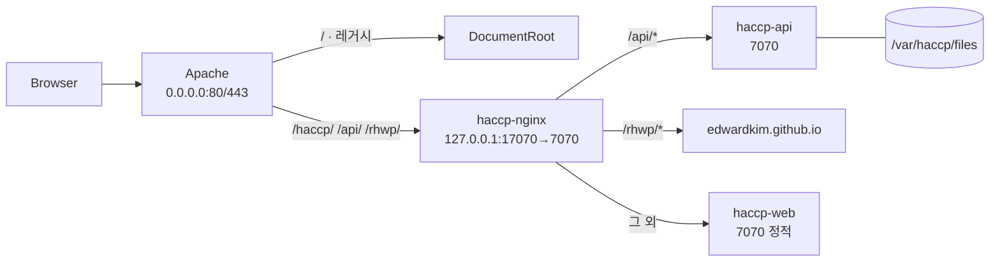
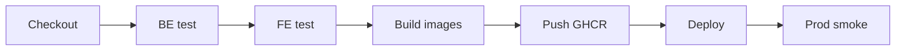

# HACCP 배포 런북

> **정본 · 배포·인프라 문서**  
> 위치: 저장소 루트 `docs/20_배포_런북.md`  
> 작성일: 2026-08-10 · 개발자: 박승우  
> 범위: 브랜치·커밋·PR·이슈 라벨·릴리스 태그 등 **배포 프로세스 규약**  
> 앱 규약 정본은 루트 `docs/1_`~`n_`, 에이전트 규칙은 `.cursor/rules/`.

이 문서는 **배포 STEP이 끝날 때마다 갱신되는 정본**이다.
STEP 산출물(브랜치·PR·태그)이 아래 규약과 어긋나면 문서가 아니라 작업을 고친다.

## 목차

1. [브랜치 전략](#1-브랜치-전략) · [커밋](#2-커밋-메시지-규약) · [PR](#3-pr-규약) · [라벨](#4-이슈-라벨) · [태그](#5-릴리스-태그)
6. [배포 전 env 체크리스트](#6-배포-전-env-체크리스트)
7. [정기 Job 운영·복구](#7-정기-job-운영복구)
8. [컨테이너 이미지](#8-컨테이너-이미지) (스택·포트·볼륨 요약)
9. [Compose 배포](#9-compose-배포)
10. [Nginx·TLS](#10-nginxtls)
11. [rhwp CLI 설치](#11-rhwp-cli-설치)
12. [시크릿·Jenkins 자격증명](#12-시크릿jenkins-자격증명)
13. [Jenkins 파이프라인](#13-jenkins-파이프라인)
14. [DB 마이그레이션·백업](#14-db-마이그레이션백업)
15. [Prod 스모크](#15-prod-스모크)
16. [롤백](#16-롤백)
17. [장애 대응](#17-장애-대응)
18. [릴리스 노트 템플릿](#18-릴리스-노트-템플릿)
19. [감시 · Nightly Audit](#19-감시--nightly-audit)
20. [STEP 진행 이력](#20-step-진행-이력)
21. [후속 STEP 16 이후](#21-후속-step-16-이후)

---

## 1. 브랜치 전략

| 브랜치 | 형식 | 용도 | 배포 |
|--------|------|------|------|
| `main` | 고정 | **배포 대상** — 항상 배포 가능한 상태 유지 | Jenkins 자동 배포 |
| 작업 | `feature/<step-nn-slug>` | STEP별 작업 브랜치 | 없음 |
| 긴급 | `hotfix/<slug>` | 운영 장애 긴급 수정 | main 병합 후 자동 |

규칙:

- `main` **직접 커밋 금지** — 규약 자체를 만든 STEP 00도 브랜치에서 시작한다
- `<step-nn>`은 2자리 고정 (`step-00`, `step-01`), `<slug>`는 소문자 하이픈 (`remove-dead-ccp-apis`)
- 예: `feature/step-00-branching-runbook`, `feature/step-01-remove-dead-ccp-apis`, `hotfix/jwt-refresh-500`
- 작업 브랜치는 main 병합 후 삭제한다

## 2. 커밋 메시지 규약

형식: `<type>(<scope>): <subject>`

| type | 의미 |
|------|------|
| `feat` | 기능 추가 |
| `fix` | 버그 수정 |
| `chore` | 잡무 (의존성·설정 등 빌드 외) |
| `docs` | 문서만 변경 |
| `refactor` | 동작 변경 없는 구조 개선 (데드코드 제거 포함) |
| `build` | 빌드·패키징·의존성 버전 |
| `ci` | Jenkins·파이프라인 |
| `db` | 스키마·SP·마이그레이션 (`db_sasshaccp/`) |

| scope | 대상 |
|-------|------|
| `fe` | `frontend/haccp-web/` |
| `be` | `backend/haccp-api/` |
| `db` | `db_sasshaccp/` |
| `infra` | Docker·Nginx·Jenkins·서버 설정 |
| `docs` | `docs/` · 각 파트 `docs/` |

작성 규칙:

- subject는 한국어 또는 영어 명령형, 마침표 없음
- 본문은 변경 이유·근거 중심 (무엇을 했는지는 diff가 말한다)
- 09 문서 G-ID가 있으면 본문 마지막에 `closes G-NN`
- 이모지 금지 (`01-project-core.mdc`)
- 소스 변경과 그에 따른 문서 정합은 **같은 커밋**에 넣는다 (중간 상태 혼란 방지)

예:

```
db(migrate): 47 번호 충돌 정리, legal-types를 48로

- 47_migrate_check_item_admin_crud 와 번호가 겹쳐 적용 순서가 비결정적이었다
- legal_upload_type 을 48로 재번호

closes G-03
```

## 3. PR 규약

| 항목 | 규칙 |
|------|------|
| 대상 | 항상 `main` |
| 제목 | `[STEP nn] <type>(<scope>): <subject>` |
| 본문 | 변경 요약 · 검증 결과 · 09 문서 G-ID 인용 (`closes G-13`) |
| 승인 | **리뷰어 없는 self-merge 금지** — 리뷰어 부재 시 자기 승인 체크박스를 모두 채운 뒤 merge |
| 병합 | squash merge 권장, 작업 브랜치 삭제 |

제목 예: `[STEP 01] refactor(fe): remove dead ccpMetalApi / ccpVerificationApi`

본문 템플릿:

```markdown
## 요약
- (변경 1)
- (변경 2)

## 근거
closes G-13 (09 문서 §3.2)

## 검증
- [ ] npx tsc --noEmit 통과
- [ ] npm run lint 통과
- [ ] 로컬 스모크 (로그인 → 해당 화면)

## 자기 승인 (리뷰어 부재 시 필수)
- [ ] 수용조건을 직접 재확인했다
- [ ] 범위 밖 파일이 diff에 없다
- [ ] 시크릿(.env 등)이 포함되지 않았다
```

## 4. 이슈 라벨

| 그룹 | 라벨 | 의미 |
|------|------|------|
| priority | `P0` | 운영 중단 — 즉시 |
| priority | `P1` | 배포 차단 — 이번 릴리스 |
| priority | `P2` | 품질·부채 — 다음 릴리스 |
| priority | `P3` | 개선 제안 — 백로그 |
| area | `fe` / `be` / `db` / `infra` / `docs` / `security` | 담당 영역 |
| status | `blocked` | 선행 작업·외부 대기 |
| status | `in-progress` | 작업 중 |
| status | `review` | PR 오픈·승인 대기 |
| status | `done` | main 병합 완료 |

이슈 1건에 priority 1개 · area 1개 이상 · status 1개를 붙인다.
09 문서 G-ID가 있으면 이슈 제목 앞에 `[G-13]`을 붙여 추적한다.

## 5. 릴리스 태그

| 항목 | 규칙 |
|------|------|
| 형식 | `v<major>.<minor>.<patch>-rc.<N>` (예: `v1.0.0-rc.3`) |
| 증가 | Jenkins가 `main` push마다 SemVer **patch**를 증가시킨다 |
| 태그 push | **수동** — 확인 후 사람이 push |
| 정식 릴리스 | 운영 검수 통과 시 `-rc.N`을 떼고 `v1.0.0` 태그 |

```bash
git tag -a v1.0.0-rc.1 -m "STEP 01 반영"
git push origin v1.0.0-rc.1
```

Jenkins 파이프라인 정의는 STEP 11에서 추가한다. 그전까지 배포는 수동이며, main 병합은 "소스·문서가 main에 반영되는 것"까지를 의미한다.

## 6. 배포 전 env 체크리스트

`.env`는 커밋하지 않으므로 배포 서버에서 손으로 채운다. 아래 항목은 **비어 있어도 앱이 기동되지만
화면이 조용히 비어 보이는** 것들이라 배포 때마다 눈으로 확인한다 (09 G-02 · G-04).

### 6.1 키 누락 감사 (재현 가능한 명령)

`.env.example`과 실제 코드가 참조하는 키가 일치하는지 배포 전에 기계로 확인한다.

```bash
# BE — application.yml 이 참조하는 ${KEY} 와 .env.example 을 양방향 대조 (출력 없으면 정합)
grep -rhoE '\$\{[A-Z][A-Z0-9_]*' backend/haccp-api/src/main/resources/application*.yml \
  | tr -d '${' | sort -u > /tmp/be_used.txt
grep -oE '^[A-Z][A-Z0-9_]*' backend/haccp-api/.env.example | sort -u > /tmp/be_example.txt
comm -3 /tmp/be_used.txt /tmp/be_example.txt

# FE — 소스가 읽는 VITE_ 키 목록
grep -rho 'VITE_[A-Z0-9_]*' frontend/haccp-web/src | sort -u
```

2026-08-10(STEP 05) 기준 **양쪽 모두 누락 0**이다. 키를 새로 추가하면 `.env.example`을 같은 커밋에 넣는다.

### 6.2 값이 비면 조용히 실패하는 항목

| 키 | 안 채우면 생기는 증상 | 확인 |
|----|----------------------|------|
| `APP_TIMEZONE` | cron이 UTC로 돌아 일집계·과제 생성이 하루 밀린다 | `Asia/Seoul` |
| `TASK_GENERATION_CRON` | 오늘 할 일이 자동 생성되지 않는다 | `0 5 0 * * *` |
| `VIEW_STAT_DAILY_CRON` | 화면 이용 통계 표가 계속 공백 (G-02) | `0 15 0 * * *` |
| `VIEW_STAT_DAILY_RUN_ON_STARTUP` | 운영은 `false` — `true`면 기동마다 재집계 | `false` |
| `APP_FILE_ROOT` | 업로드는 되는데 재기동 후 파일이 사라진다(컨테이너 내부 경로) | 볼륨 마운트 경로 |
| `APP_RHWP_CLI_PATH` | PDF 내보내기·미리보기만 실패 (G-04) | 실행 권한까지 확인 |
| `APP_RHWP_FONT_PATH` | PDF가 나오지만 한글이 깨진다 (G-04) | Nanum 폰트 경로 |
| `APP_TEMPLATE_IMPORT_ROOT` | 비우면 기동 시 표준 양식 import 스킵 | 최초 배포만 지정 |
| `JWT_SECRET` | 64바이트 미만이면 **기동 자체가 실패** | `openssl rand -hex 48` |
| `CORS_ALLOWED_ORIGINS` | 로그인 요청이 브라우저에서 차단된다 | 운영 도메인 |

### 6.3 파일 크기 3키 정합

세 값은 **함께** 움직인다. 하나만 바꾸면 "요청은 통과하는데 저장만 실패" 또는 그 반대가 된다.

| 키 | 기본 | 매핑 |
|----|------|------|
| `APP_FILE_MAX_BYTES` | `20971520` | `app.file.max-bytes` — Storage가 바이트로 검사 |
| `APP_FILE_MAX_SIZE` | `20MB` | `spring.servlet.multipart.max-file-size` |
| `APP_FILE_MAX_REQUEST_SIZE` | `25MB` | `spring.servlet.multipart.max-request-size` |

규칙: `APP_FILE_MAX_BYTES` = `APP_FILE_MAX_SIZE`(Spring은 MB를 1024^2로 해석하므로 20MB = 20971520),
`APP_FILE_MAX_REQUEST_SIZE` > `APP_FILE_MAX_SIZE` (multipart 경계·헤더 여유).

## 7. 정기 Job 운영·복구

Job은 둘 다 SP 멱등이라 **여러 번 돌려도 결과가 같다**. 놓친 날이 있으면 다시 돌리면 된다.

| Job | 클래스 | 기본 시각 | 호출 SP |
|-----|--------|-----------|---------|
| 작성 과제 생성 | `DailyTaskGenerationJob` | 00:05 | `sp_tbl_schedule_task_generate_c_000(coCd, baseDt, userId)` |
| 화면 UV/PV 일집계 | `ViewStatDailyJob` | 00:15 | `sp_tbl_view_stat_daily_c_000(coCd, statDt, userId)` |

### 7.1 과제가 생성되지 않았을 때

1. 별도 조치 없이도 사용자가 "오늘 할 일" 화면을 열면 그 회사분이 즉시 생성된다 —
   `TaskService.todayTasks()`가 조회 전에 `generateTasks`를 호출하기 때문이다.
2. 전사 일괄이 필요하면 DB에서 직접 돌린다 (활성 회사 루프).

```sql
-- 특정 일자(YYYYMMDD)를 전 활성 회사에 재생성 — 멱등
DO $$
DECLARE r record;
BEGIN
  FOR r IN SELECT co_cd FROM sasshaccp.tbl_company WHERE use_yn = 'Y' LOOP
    CALL sasshaccp.sp_tbl_schedule_task_generate_c_000(r.co_cd, '20260810', 'system');
  END LOOP;
END $$;
```

### 7.2 통계 표가 비어 있을 때 (G-02)

1. `APP_TIMEZONE` · `VIEW_STAT_DAILY_CRON`이 채워졌는지 먼저 본다 — 대부분 여기서 끝난다.
2. 과거 일자를 메우려면 DB에서 날짜별로 호출한다. 첫 인자 `''`(빈 문자열)이 **전 회사**다.

```sql
CALL sasshaccp.sp_tbl_view_stat_daily_c_000('', '20260809', 'system');
```

3. DB 접근이 어려우면 `VIEW_STAT_DAILY_RUN_ON_STARTUP=true`로 두고 재기동하면
   전일·당일 2건이 집계된다. **집계 후 다시 `false`로 되돌린다** — 기동마다 재집계하지 않기 위해서다.

## 8. 컨테이너 이미지

공인 입구는 **호스트 Apache(80/443) Path 분기**다. Docker edge는 루프백만 열고
정적·API·rhwp를 한 출처로 합친다. FE는 Vite `base=/haccp/`로 빌드한다.



### 8.1 이미지 3종

| 이미지 | Dockerfile | 베이스(실행) | 포트(컨테이너) | 실행 계정 |
|--------|-----------|--------------|----------------|-----------|
| `haccp-api` | `backend/haccp-api/Dockerfile` | `eclipse-temurin:17-jre-jammy` | 7070 | uid 1000 `haccp` |
| `haccp-web` | `frontend/haccp-web/Dockerfile` | `nginxinc/nginx-unprivileged:1.27-alpine` | 7070 | uid 101 `nginx` |
| `haccp-nginx` | `nginx/Dockerfile` | `nginxinc/nginx-unprivileged:1.27-alpine` | 7070 | uid 101 `nginx` |

unprivileged nginx라 컨테이너 안에서는 1024 미만을 열 수 없다.
호스트에는 **edge만** `127.0.0.1:17070:7070` (override). api·web은 publish 없음.
**CLOSE:** 호스트 `8080` · `8443` · Docker가 잡는 `80`/`443`.

```bash
docker build -f backend/haccp-api/Dockerfile  -t haccp-api:local   .
docker build -f frontend/haccp-web/Dockerfile -t haccp-web:local   frontend/haccp-web
docker build -f nginx/Dockerfile              -t haccp-nginx:local nginx
```

### 8.2 실측 크기 (2026-08-10)

| 이미지 | 디스크(비압축) | 전송(압축) |
|--------|---------------|-----------|
| `haccp-api` | 485 MB | 137 MB |
| `haccp-web` | 74.7 MB | 21 MB |
| `haccp-nginx` | 73.7 MB | 20 MB |

`haccp-api` 내역: ubuntu jammy 88MB + temurin JRE 193MB + 한글 폰트·curl 35MB + JAR 31MB.
줄이려면 alpine JRE로 바꿔야 하는데 musl 기반이라 외부 마운트하는 rhwp CLI(glibc)가 안 돌 위험이 있어 유지한다.

### 8.3 볼륨·환경변수

| 마운트 | 용도 | 필수 |
|--------|------|------|
| `/var/haccp/files` | 업로드 원본·생성 PDF — 컨테이너를 지워도 문서가 남아야 한다 | 필수 |
| `/var/haccp/templates` | 표준 양식 원본(읽기 전용) | 임포트할 때만 |
| `/opt/rhwp` | rhwp CLI 바이너리 — 라이선스상 이미지에 넣지 않는다 | HWP·PDF 쓸 때 |
| `/etc/letsencrypt` | 호환 마운트(edge는 TLS 미사용). 공인 TLS는 Apache `/etc/ssl/haccp/` | 선택 |

이미지에 **의도적으로 비워 둔 두 값**이 있다.

- `APP_TEMPLATE_IMPORT_ROOT` — 값이 있으면 `TemplateImportService`가 기동 직후 매니페스트를 검사하고
  `required` 양식이 하나라도 없으면 기동을 중단한다. 빈 볼륨으로 올리면 컨테이너가 즉사하므로,
  원본을 마운트한 배포에서만 `-e APP_TEMPLATE_IMPORT_ROOT=/var/haccp/templates`로 켠다.
- `APP_RHWP_CLI_PATH` — 바이너리를 마운트한 경로를 실행 시 지정한다.

`DB_USERNAME` · `DB_PASSWORD` · `JWT_SECRET`은 **기본값이 없어 주입하지 않으면 기동이 실패한다**
(`Could not resolve placeholder 'JWT_SECRET'`). 나머지 키는 §6 체크리스트를 따른다.

프론트는 `--build-arg VITE_API_BASE_URL=""`(기본값)로 구워 axios가 상대경로를 쓴다.
절대 주소가 필요한 예외 배포에서만 이 인자를 덮는다.

### 8.4 기동 예시

```bash
docker network create haccp
docker run -d --name haccp-api --network haccp \
  -e DB_URL=jdbc:postgresql://<host>:5432/sasshaccp -e DB_USERNAME=... -e DB_PASSWORD=... \
  -e JWT_SECRET=... -v /srv/haccp/files:/var/haccp/files haccp-api:local
docker run -d --name haccp-web   --network haccp haccp-web:local
docker run -d --name haccp-nginx --network haccp -p 127.0.0.1:17070:7070 haccp-nginx:local
```

Compose 서비스명(`api` · `web`)이 곧 DNS 이름이다 — edge conf가 이 이름으로 찾으므로
**서비스명을 바꾸면 conf도 함께 고쳐야 한다**. 또한 기본 bridge 네트워크에는 도커 내장 DNS(127.0.0.11)가
없어 프록시가 502가 되므로 사용자 정의 네트워크(`haccp-net`)가 필수다. 일괄 기동은 §9를 본다.

### 8.5 헬스체크

| 이미지 | 엔드포인트 | 정상 |
|--------|-----------|------|
| `haccp-api` | `/actuator/health` | DB 연결 시 200 `UP` — DB가 없으면 503 `DOWN`이 정상 동작이다 |
| `haccp-web` | `/` | 200 |
| `haccp-nginx` | `/healthz` | 200 — 업스트림이 죽어도 edge 자체 생존만 본다 |

### 8.6 STEP 09에서 반영된 항목

TLS(8443)·HSTS·파일 경로 130s 타임아웃·`/actuator` 차단은 §10에 정리했다.
Compose 일괄 기동은 §9, rhwp 볼륨 설치는 §11을 본다.

## 9. Compose 배포

정본 파일: 루트 [`docker-compose.prod.yml`](../docker-compose.prod.yml) · [`.env.docker.example`](../.env.docker.example).

브라우저 공인 포트는 **Apache 80/443뿐**이다. Docker edge는 `127.0.0.1:17070`만.
api·web(7070)·db(5432)는 내부망 전용. 예시 override: [`docker-compose.override.example.yml`](../docker-compose.override.example.yml).

### 9.1 선행 필수 (빠뜨리면 api가 기동 실패)

```bash
cp .env.docker.example .env.docker   # 값 채우기
bash scripts/init_volumes.sh         # 표준 양식 38건 → haccp-templates (필수)
bash scripts/install_rhwp.sh         # rhwp CLI → haccp-rhwp (PDF 쓸 때)
HACCP_CERT_HOST_DIR=./certs bash scripts/gen_selfsigned.sh   # 도메인 없을 때
```

`APP_TEMPLATE_IMPORT_ROOT`가 compose에서 `/var/haccp/templates`로 켜져 있다.
볼륨이 비어 있으면 기동은 하고, 양식 파일 관리 화면에서 「로컬열기」후 「저장」으로 실물을 채운다.
원본 HWP를 한 번에 넣으려면 루트 `docs/templates/`(로컬 전용, git 미추적)에 두고 `init_volumes.sh`를 돌린다.

`haccp-files` · `haccp-templates` · `haccp-rhwp` 세 볼륨은 `external: true`다 —
초기화 스크립트를 건너뛰면 compose가 `volume not found`로 즉시 멈춘다.

### 9.2 프로파일별 실행

`${REGISTRY}` · `${DB_USERNAME}` 같은 **파일 치환값은 `env_file`이 아니라 `--env-file`로 읽힌다.**
반드시 아래처럼 호출한다.

```bash
# 외부 PostgreSQL (기본)
docker compose --env-file .env.docker -f docker-compose.prod.yml up -d

# 내부 PostgreSQL (프로필 with-db)
docker compose --env-file .env.docker -f docker-compose.prod.yml --profile with-db up -d
```

내부 PG를 쓸 때는 `.env.docker`의 `DB_URL` 호스트를 서비스명 `db`로 바꾼다.
스키마 적재:

```bash
docker compose --env-file .env.docker -f docker-compose.prod.yml --profile with-db \
  exec -T -e PGHOST=localhost -e PGUSER=... -e PGPASSWORD=... -e PGDATABASE=sasshaccp \
  db bash /db_sasshaccp/apply-all.sh
```

`postgres:16`(debian)을 쓰는 이유 — alpine에는 `bash`·GNU `ls -v`가 없어 `apply-all.sh`가 바로 안 돈다.

### 9.3 볼륨 목록

| 볼륨 | 마운트 | 생성 | 용도 |
|------|--------|------|------|
| `haccp-files` | api `/var/haccp/files` | `init_volumes.sh` (external) | 업로드·생성 PDF |
| `haccp-templates` | api `/var/haccp/templates:ro` | `init_volumes.sh` (external) | 표준 양식 원본 |
| `haccp-rhwp` | api `/opt/rhwp:ro` | `install_rhwp.sh` (external) | rhwp CLI |
| `haccp-db-data` | db data | compose | 내부 PG 데이터 |
| `haccp-acme` | edge `/var/www/certbot` | compose | certbot webroot |

네트워크 이름: `haccp-net`. edge conf가 서비스명 `api` · `web`으로 찾으므로
컨테이너 이름을 바꾸면 conf도 함께 고쳐야 한다.

### 9.4 헬스체크 기대값

| 서비스 | healthy 조건 |
|--------|-------------|
| db | `pg_isready` |
| api | `/actuator/health` 200 (DB 연결 포함) |
| web | 컨테이너 내부 `http://127.0.0.1:7070/` 200 |
| edge | 호스트 `http://127.0.0.1:17070/healthz` 200 |

alpine nginx는 `localhost`가 `::1`로 풀리면 실패하므로 헬스체크 URL은 **`127.0.0.1`**을 쓴다.

## 10. Nginx·Apache Path·TLS

정본: [`nginx/haccp.conf.template`](../nginx/haccp.conf.template) ·
Apache 예시 [`nginx/apache-haccp-gateway.conf.example`](../nginx/apache-haccp-gateway.conf.example).
edge 기동 시 envsubst가 `${HACCP_*}`를 치환한다.
필터 `NGINX_ENVSUBST_FILTER=^HACCP_`가 없으면 `$host`까지 비워져 conf가 망가진다.

### 10.1 포트 (최종)

| 포트 | 바인딩 | 상태 | 역할 |
|------|--------|------|------|
| 80 | Apache `0.0.0.0` | KEEP | 레거시 `/` + Path |
| 443 | Apache `0.0.0.0` | KEEP | TLS 종단 + Path |
| 17070 | Docker `127.0.0.1` | KEEP | Apache → edge:7070 |
| 8080 | — | **CLOSE** | 구 edge HTTP 우회 |
| 8443 | — | **CLOSE** | 구 edge HTTPS 우회 |

Path: `/` 레거시 · `/haccp/` FE(프리픽스 제거 후 edge) · `/api/` · `/rhwp/` → `http://127.0.0.1:17070/...`.
CORS: `https://IP,http://IP` (`:8443` 제거). 스모크: `https://IP` + `SMOKE_WEB_PREFIX=/haccp`.

### 10.2 타임아웃 (OPS_TIMEOUT_DEFENSE)

| 구분 | proxy_read/send | 근거 |
|------|-----------------|------|
| 일반 `/api/` | 70s | 백엔드 TX 60s + Nginx Grace 10s |
| 파일·PDF 경로 | 130s | FE httpFile 120s · rhwp CLI 110s보다 큼 |
| connect | 10s | 업스트림 연결 |

파일 경로 정규식(실측):  
`/doc/documents/{docIdx}/(files|export-pdf)` · `/doc/documents/files/{fileIdx}/download` ·  
`/doc/templates/{tmplCd}/form` · `/doc/audit-export/preview-pdf` ·  
`/sys/users/{id}/sign` · `/hyg/health-cert/{idx}/file` ·  
`/bas/equipment/{idx}/photo` · `/bas/company-templates/create-custom`

`client_max_body_size 30M` — 백엔드 25MB보다 크게 잡아 크기 초과 문구는 백엔드가 낸다.

### 10.3 `/actuator` 차단

기본은 `HACCP_ACTUATOR_ALLOW=127.0.0.1` 한 줄만 허용하고 나머지는 `deny all`.
`allow 172.16.0.0/12`처럼 도커 브리지 대역을 통째로 열면 게시 포트로 들어온 요청까지 통과한다.
컨테이너 자체 헬스체크는 내부 localhost라 이 규칙과 무관하다.

### 10.4 인증서

- **도메인 없음(로컬·사전 검증):** `HACCP_CERT_HOST_DIR=./certs bash scripts/gen_selfsigned.sh`  
  → `./certs/live/{HACCP_SERVER_NAME}/fullchain.pem` · `privkey.pem`
- **Let's Encrypt:** certbot webroot를 `haccp-acme` 볼륨(`/var/www/certbot`)에 두고  
  http-01로 발급·갱신한다. edge를 내리지 않아도 된다.

```bash
# 예: certbot (호스트에서)
certbot certonly --webroot -w /var/lib/docker/volumes/haccp-acme/_data \
  -d haccp.example.com --email ops@example.com --agree-tos
# HACCP_CERT_HOST_DIR=/etc/letsencrypt 로 compose up
```

CORS는 nginx가 건드리지 않는다 — `CORS_ALLOWED_ORIGINS`는 API가 처리한다(동일출처면 사실상 미사용).

## 11. rhwp CLI 설치

라이선스: MIT ([edwardkim/rhwp](https://github.com/edwardkim/rhwp)).
이미지에는 넣지 않고 named volume `haccp-rhwp`에 설치한다 — 버전 교체를 재빌드 없이 하기 위해서다.

```bash
bash scripts/install_rhwp.sh          # 기본 v0.8.2
bash scripts/install_rhwp.sh v0.9.0   # 버전 지정
# 또는 RHWP_VERSION=v0.9.0
```

스크립트는 릴리스의 `SHA256SUMS.txt`로 무결성을 검증한 뒤  
`/opt/rhwp/rhwp`(컨테이너 경로)에 uid 1000·0755로 넣고 `--version`으로 자가 검증한다.

API 이미지는 **glibc(jammy)** 이다. alpine JRE로 줄이면 rhwp가 실행되지 않는다.

### 11.1 PDF 실패 진단

| 증상 | 확인 |
|------|------|
| "PDF 변환기가 설정되지 않았습니다" | `APP_RHWP_CLI_PATH` 비어 있음 |
| "PDF 변환기를 찾을 수 없습니다" | `haccp-rhwp` 볼륨 미설치 · 경로 불일치 |
| 한글이 빈칸·깨짐 | `APP_RHWP_FONT_PATH` · fonts-nanum |
| Permission denied | 볼륨 소유자가 uid 1000이 아님 → `install_rhwp.sh` 재실행 |
| 타임아웃 | edge 파일 location 130s · `APP_RHWP_TIMEOUT_SECONDS` 110 |

실변환 스모크(컨테이너 안):

```bash
docker compose exec api /opt/rhwp/rhwp --version
docker compose exec api /opt/rhwp/rhwp export-pdf \
  /var/haccp/files/HaccpTemplates/tmpl_prp-calib-temp/자체_검_교정_일지_1.hwp \
  -o /tmp/verify.pdf --font-path /usr/share/fonts/truetype/nanum \
  --fallback-serif NanumGothic --fallback-sans NanumGothic
```

`RHWP_VERSION`은 `scripts/install_rhwp.sh` / `.env.docker`의 `RHWP_VERSION`으로 통제한다.

## 12. 시크릿·Jenkins 자격증명

이 저장소는 **public**이다. 시크릿은 git에 올리지 않고 Jenkins Credentials와 서버 파일로만 둔다.

### 12.1 Jenkins Credentials

| ID | 종류 | 용도 |
|----|------|------|
| `haccp-registry-cred` | Username/password (GHCR PAT) | 이미지 push |
| `haccp-deploy-ssh-key` | SSH private key | prod 서버 접근 |
| `haccp-deploy-host` | Secret text | `user@host` 또는 host |
| `haccp-github-token` | Secret text | 웹훅·nightly 이슈 생성 |
| `haccp-env-docker` | Secret file | 서버에 배포할 `.env.docker` 원본 |
| `haccp-smoke-user` | Username/password | prod 스모크 `SMOKE_USER`/`SMOKE_PASS` (조회 전용) |
| `haccp-write-user` | Username/password | Playwright E2E `E2E_USER`/`E2E_PASS` (냉장 write·상신 · `Jenkinsfile.e2e`) |

Jenkinsfile·compose·스크립트에는 `${credentials('...')}` / `withCredentials` 이외 방법으로 시크릿을 넣지 않는다.

### 12.2 서버 파일 배치

| 경로 | 권한 | 비고 |
|------|------|------|
| `/opt/haccp/.env.docker` | root:root `0600` | JWT·DB·CORS 등 |
| `/opt/haccp/docker-compose.prod.yml` | 배포 계정 읽기 | rsync로 갱신 |
| `/opt/haccp/nginx/haccp.conf.template` | 배포 계정 읽기 | 이미지 envsubst가 치환 |

Jenkins는 SSH로 rsync 후 `docker compose pull && up -d`를 실행한다 (시크릿 파일은 전송하지 않음).

### 12.3 JWT_SECRET 회전

1. `openssl rand -hex 48` 로 새 시크릿 생성 (96자 hex ≥ 64바이트)
2. `/opt/haccp/.env.docker`의 `JWT_SECRET` 갱신
3. `docker compose --env-file .env.docker -f docker-compose.prod.yml up -d api`
4. **재기동 순간 기존 JWT 전부 무효** — 사용자는 재로그인 필요. 배포 창구(근무 외 시간)를 안내한다.

긴급 재발급도 동일 절차다. 회전 전후로 스모크 로그인 단계를 확인한다.

### 12.4 실수 방지

- `.gitignore`: `.env` · `*.env` · `.env.docker` (예제만 예외)
- 커밋 훅: `bash scripts/pre-commit-check-secrets.sh`  
  (`ln -sf ../../scripts/pre-commit-check-secrets.sh .git/hooks/pre-commit`)

## 13. Jenkins 파이프라인

정본: 루트 [`Jenkinsfile`](../Jenkinsfile).



**DB migrate / dry-run은 파이프라인에서 제외**한다.  
당분간 스키마·SP 정본은 **DBeaver(운영 DB)**. 저장소 SQL 자동 적용은 DBeaver 수정을 덮을 수 있다.  
필요 시 운영자가 수동으로 `db_migrate_dryrun.sh` 또는 compose `--profile migrate`만 실행한다.

### 13.1 첫 등록

1. Jenkins에 Multibranch 또는 Pipeline job 생성 → SCM = 이 저장소, Script Path = `Jenkinsfile`
2. Credentials 6종 등록 (§12.1)
3. 트리거: 아래 **개발/테스트 vs 이후** 정책을 따른다
4. `main` 반영 후 Job에서 실행 (개발/테스트는 Build Now)

#### 트리거 정책 — Build Now 우선 (개발/테스트)

**개발/테스트 (현재):** Jenkins가 localhost이면 GitHub webhook을 쓰지 않는다.  
main 반영 후 `haccp-deploy` Job에서 **Build Now**로 실행한다.  
이 방식은 공인 URL 이전 단계에서 널리 쓰이며, 파이프라인·시크릿·SSH를 먼저 안정화할 때 적합하다.

`http://localhost:9090/github-webhook/` 은 GitHub 서버에서 도달할 수 없다.  
지금 단계에서 webhook·pollSCM·터널을 억지로 붙이지 않는다.  
`Jenkinsfile`의 `githubPush()`는 그대로 둬도 되며, 외부 URL이 생기기 전에는 사실상 동작하지 않는다.

**이후 (운영 자동화):** Jenkins에 HTTPS(또는 cloudflared/ngrok 등 터널)로 외부 도달 URL이 생기면  
`https://<jenkins>/github-webhook/` + Push events 로 자동화한다.

`disableConcurrentBuilds()` 필수 — 동시 `compose up` 충돌 방지.  
`ansiColor` 플러그인은 필수가 아니어서 파이프라인 options에서 제외했다.

### 13.2 스크립트

정본 목록·유지/삭제 기준: [`scripts/README.md`](../scripts/README.md).

| 스크립트 | 역할 |
|----------|------|
| `scripts/build_images.sh` | api/web/nginx 빌드 |
| `scripts/deploy_remote.sh` | rsync + remote pull/up |
| `scripts/db_migrate_dryrun.sh` | (수동) 저장소 SQL 문법 dry-run — CI 미사용 |
| `scripts/prod_smoke.sh` | 배포 후 9단계 |
| `scripts/init_volumes.sh` · `install_rhwp.sh` · `gen_selfsigned.sh` | compose 선행 |
| `scripts/audit_*.sh` | nightly `Jenkinsfile.audit` (G-26) |

태그: `1.0.${BUILD_NUMBER}` + `latest` 동시 push.

## 14. DB 마이그레이션·백업

- 이미지: [`db_sasshaccp/Dockerfile.migrate`](../db_sasshaccp/Dockerfile.migrate) (`postgres:16` debian)
- compose profile `migrate`: `docker compose --env-file .env.docker -f docker-compose.prod.yml --profile migrate run --rm migrate`
- profile `backup`: 동일 방식으로 `pg_dump -Fc` → 볼륨 `haccp-db-backup`

`apply-all.sh`는 `IF NOT EXISTS` / `ON CONFLICT` / `CREATE OR REPLACE` 기반이라 **여러 번 돌려도 결과가 같다**.  
다만 **롤백 SQL은 제공하지 않는다** — 되돌리려면 `99_rollback_*`를 따로 쓰거나 dump 복원만 한다.

파이프라인은 DB migrate를 **돌리지 않는다**(§13).  
저장소 SQL을 운영에 반영할 때는 운영자가 수동으로 compose `--profile migrate`를 실행한다.  
`bash scripts/db_migrate_dryrun.sh`도 수동 검증용이다.

메뉴 URL 슬러그 정본은 [`120_migrate_menu_url_slugs.sql`](../db_sasshaccp/120_migrate_menu_url_slugs.sql)이다. 경로 규칙은 [`24_URL_DB_폴더_패키지_정본.md`](24_URL_DB_폴더_패키지_정본.md).

1. Jenkins는 이 파일을 **돌리지 않는다**. 로컬·운영 모두 운영자가 수동 실행한다.
2. DBeaver에서 120을 실행하거나, `apply-all.sh` / compose `--profile migrate`를 쓰면 번호 순에 120이 포함된다. 118·119를 이미 적용한 DB도 구 이름을 받아 덮으므로 재실행해도 된다.
3. `UNIQUE (co_cd, menu_cd)` 때문에 대분류 2행을 동시에 `docs`로 UPDATE하지 않는다. 120 트랜잭션 순서를 그대로 따른다.
4. 적용 후 확인:

```sql
SELECT menu_cd, h_menu_cd, scrn_cd, menu_nm
  FROM sasshaccp.tbl_menu
 WHERE menu_cd IN ('docs','flow','bas','sys')
    OR menu_cd LIKE 'menu-doc-%'
    OR (scrn_cd IS NOT NULL AND menu_cd <> scrn_cd);
```

   대분류 `docs`/`flow`/`bas`/`sys`가 있고, `menu-doc-write` 등 구 대분류는 0건, leaf는 `menu_cd = scrn_cd` 이어야 한다. `tbl_role_screen`은 `scrn_cd`라 **권한 UPDATE는 하지 않는다**.
5. 재로그인 후 사이드바: 「문서」「문서 현황·결재」「기초정보」「시스템」. 「문서 작성」과 「문서 기준관리」는 「문서」로 합쳐진다.
6. 롤백 SQL은 없다. 되돌리려면 dump 복원만 한다. 이력 52·99·118·119는 고치지 않는다.

## 15. Prod 스모크

자동 최소 9단계는 아래 스크립트. 화면별 수동 표(DB형·HWP 27·CRUD·파일)는  
[`19_스모크_매트릭스.md`](19_스모크_매트릭스.md) (STEP 06).

`SMOKE_USER` / `SMOKE_PASS` (조회 전용 계정 권장 — 결재·삭제 권한 부여 금지).

```bash
SMOKE_USER=... SMOKE_PASS=... bash scripts/prod_smoke.sh https://haccp.example.com
# 로컬 self-signed:
SMOKE_INSECURE=1 SMOKE_USER=admin SMOKE_PASS=... bash scripts/prod_smoke.sh https://127.0.0.1
```

| # | 단계 | 실패 시 의심 |
|---|------|-------------|
| 1 | `GET /healthz` | edge 미기동·포트 매핑 |
| 2 | `GET /` title | web 이미지·프록시 |
| 3 | login `password` | JWT/DB/계정 |
| 4 | `/auth/me` | 토큰·필터 |
| 5 | `/menu/list` ≥5 | 메뉴 시드·권한 |
| 6 | `approval-history` leaf | STEP 03 회귀 (migrate 49) |
| 7 | `/api/v1/docs/ccp/ccp-cold-monitor/list` | CCP API·권한 |
| 8 | company-templates list | 워크플로 API (법적서류 LAW는 이 목록) |
| 9 | view/collect 2xx | 로그 API |

외부 `/actuator`는 deny다. 사내망에서만 `SMOKE_CHECK_ACTUATOR=1`로 추가 검사.

## 16. 롤백

### 16.1 이미지 롤백 (가장 빈번)

```bash
# 서버 /opt/haccp
export TAG=1.0.$((N-1))   # 직전 성공 빌드
docker compose --env-file .env.docker -f docker-compose.prod.yml pull
docker compose --env-file .env.docker -f docker-compose.prod.yml up -d
bash scripts/prod_smoke.sh https://haccp.example.com
```

### 16.2 DB 롤백

SP·DDL 자동 롤백 없음. 배포 전 `profiles: ["backup"]`으로 dump를 남기고,
문제 시 `pg_restore`로 복원한다. 앱 이미지만 롤백한 뒤 스키마가 앞서 있으면
구버전이 새 컬럼을 모를 수 있으므로 **스키마 변경 배포는 반드시 사전 백업**.

## 17. 장애 대응

| 증상 | 원인 | 조치 |
|------|------|------|
| 502 on /api | api 미기동·네트워크 | `compose ps` · 로그 · `haccp-net` |
| 로그인 전부 실패 | JWT 회전 직후 | 재로그인 안내 · secret 오타 확인 |
| 양식 원본 없음 | 템플릿 볼륨 빈 상태 | 양식 파일 관리 「로컬열기」후 저장 · 또는 `init_volumes.sh` |
| PDF 실패 | rhwp/폰트 | §11 진단표 |
| approval-history 없음 | 메뉴 leaf | migrate 49 · 스모크 6단계 |
| 외부 actuator 403 | 의도된 차단 | `/healthz` 사용 · allow CIDR은 사내만 |
| compose volume not found | external 미생성 | `init_volumes.sh` · `install_rhwp.sh` |

## 18. 릴리스 노트 템플릿

```markdown
# HACCP v1.0.N — YYYY-MM-DD

## 요약
-

## 변경
- FE:
- BE:
- DB:
- Infra:

## 마이그레이션
- [ ] backup profile 실행
- [ ] migrate profile 실행

## 검증
- [ ] prod_smoke OK
- [ ] 핵심 화면 수동 확인

## 롤백
이전 TAG: 1.0.(N-1)
```

## 19. 감시 · Nightly Audit

정본: [`Jenkinsfile.audit`](../Jenkinsfile.audit) — cron UTC 18:00 (KST 03:00).

| 스크립트 | 검사 |
|----------|------|
| `audit_version_drift.sh` | README 스택 버전 vs package.json/pom |
| `audit_ops_delete.sh` | HTTP DELETE · @DeleteMapping · validate/delete 짝 |
| `audit_file_size_alignment.sh` | 파일 크기 3키 |
| `audit_docs_links.sh` | docs 상대 md 링크 |

실패 시 `haccp-github-token`으로 GitHub 이슈 생성. **소스 자동 수정 금지.**  
09 G-26으로 추적한다.

## 20. STEP 진행 이력

| STEP | 브랜치 | 내용 | 병합 | 상태 |
|------|--------|------|------|------|
| 00 | `feature/step-00-branching-runbook` | 배포 런북·브랜치 규약 신설 | `d9dc4b6` | 완료 |
| 01 | `feature/step-01-remove-dead-ccp-apis` | dead FE API·config 제거 (closes G-13) | `8f1dab4` | 완료 |
| 02 | `feature/step-02-migrate-47-conflict` | migrate 47 → legal 48 (closes G-03) | `9915897` | 완료 |
| 03 | `feature/step-03-menu-approval-history` | approval-history migrate 49 (closes G-01) | `d367a68` | 완료 |
| 04 | `feature/step-04-legal-form-guard` | form 400→404 (closes G-05) | `97856f9` | 완료 |
| 05 | `feature/step-05-env-checklist` | env·Job 복구 (closes G-02·G-04) | `e064987` | 완료 |
| 06 | `feature/step-06-smoke-matrix` | 스모크 매트릭스 문서 (closes G-10·G-11) | `b81acf6` | 완료 (2026-08-10) |
| 07 | `feature/step-09-compose-nginx` | Dockerfile 3종 (08·09와 동일 브랜치) | `4d9b1a1` | 완료 (2026-08-10) |
| 08–09 | `feature/step-09-compose-nginx` | 이미지·compose·Nginx TLS·rhwp | `4d9b1a1` | 완료 (2026-08-10) |
| 10–14+audit | `feature/step-10-14-ci-deploy` | 시크릿·Jenkins·migrate·스모크·런북·감시 | `8b5fe39` | 완료 (2026-08-10) |
| 16 | (ops) | Jenkins Credentials 6종 | - | 완료 (2026-08-11) |
| 17 | (ops) | 서버 `/home/ubuntu/haccp` 부트스트랩·migrate·스택 | - | 완료 (2026-08-11) — apache `:80` 점유로 edge `8080/8443` override (**의도적 잔존**, 표준 80/443은 후속 ops) |
| 18 | `feature/step-18-19-jenkins-prod-align` | Job `haccp-deploy`/`haccp-audit`, SMOKE/CORS/deploy override | `908e49b` | 완료 (2026-08-11). webhook은 §13.1대로 HTTPS/터널 이후 |
| 19 | (ops) | 첫 파이프라인 초록·수동 스모크 | `840589a` | **완료 (2026-08-11)** — 아래 §20.1 |
| (ops) | `feature/step-apache-path-7070` | Apache Path(`/haccp`·`/api`) · edge `127.0.0.1:17070:7070` · 내부 7070 통일 · **CLOSE 8080/8443** | - | 진행 중 |
| 20 | `feature/step-20-g14-api-decision` | G-14 smart-diary 폐기 · audit-export 동결 | PR #5 | 완료 (2026-08-11) |
| 21–22 | `feature/step-21-22-docs` | G-16 06/09 합본 · G-20 BE 00 인덱스 | PR #6 | 완료 (2026-08-11) |
| 23 | `feature/step-23-g15-bizops-docs` | G-15 BizOps API 잔존·UI HWP 표 | PR #7 | 완료 (2026-08-11) |
| 24 | `feature/step-24-g22-cross-tab-logout` | G-22 멀티탭 로그아웃 · Path basename | PR #8 | 완료 (2026-08-11) |
| 25 | `feature/step-25-g23-grid-pref` | G-23 그리드 pref·가상화 스모크 | PR #9 | 완료 (2026-08-11) |
| 26 | `feature/step-26-g24-sign-ux` | G-24 서명 UX 가이드 (11 §2.8) | PR #10 | 완료 (2026-08-11) |
| 27 | `feature/step-27-g25-legal-policy` | G-25 법적서류 미리보기 동결 | PR #11 | 완료 (2026-08-11) |
| 28 | `feature/step-28-g21-playwright-e2e` | G-21 Playwright 최소 E2E | PR #12 | 완료 (2026-08-11) |
| 29 | `feature/step-29-hwp-form-cycle` | 사용양식 구분·문서주기관리 · 영역 `hwp` 분할 · migrate 84·85 | PR #31 | 완료 (2026-08-14) |
| 30 | `feature/step-30-hwp-form-cycle-ux` | 사용양식 파일버튼·문서주기 검색·시스템양식 목록 · migrate 86·87 | (PR) | 진행 중 |

### 20.1 STEP 19 클로즈 근거 (2026-08-11)

| 수용조건 | 결과 |
|----------|------|
| Jenkins `haccp-deploy` 전 구간 초록 | #13 SUCCESS · TAG `1.0.13` · `PROD SMOKE OK` |
| 트리거 | Build Now (localhost · §13.1) |
| §6 env 육안 | `.env.docker` mode 600 · JWT len=96 · CORS에 `:8443` · compose config OK · 핵심 3서비스 healthy. `APP_TIMEZONE`/cron 키는 yml 기본값(`Asia/Seoul`, `0 5 0 * * *` 등) |
| 브라우저 수동 | smoke 로그인 · 메뉴 · `ccp-cold-monitor` 목록 · `legal-document-upload`(LAW form 없음·다운로드 비활성) · HWP 샘플 5화면 목록 |
| G-12 오늘 할 일 | 화면 정상 · 당일 과제 0건(「오늘 예정된 과제가 없습니다」) · 최근 문서 표시 |
| 스모크 매트릭스 | [`19_스모크_매트릭스.md`](19_스모크_매트릭스.md) STEP 19 기록 · HWP 5종 목록 OK · 참조차단 validate-delete 문구 OK |
| `haccp-audit` | #1 SUCCESS (`nightly audit OK`) |
| edge 포트 | 구 `8080/8443` 우회는 **CLOSE**. 정본: Apache 80/443 + `127.0.0.1:17070:7070` |

운영 권고(값 재기록 금지): 채팅에 노출된 Jenkins 비밀번호·GHCR PAT는 **회전**할 것.

릴리스 태그는 수동. Jenkins SemVer는 파이프라인 `TAG=1.0.${BUILD_NUMBER}`로 이미지에 부여한다.

## 21. 후속 STEP 16 이후

배포 파이프라인 코드(STEP 00–15) 다음의 **실운영 마감**과 **잔여 G-ID**는 의존 순서가 있다.
에이전트 프롬프트 정본: [`21_후속_STEP_16이후.md`](21_후속_STEP_16이후.md).

| 구간 | STEP | 한 줄 |
|------|------|--------|
| 운영 마감 | 16→17→18→19 | 시크릿 → `/home/ubuntu/haccp`(또는 `/opt/haccp`) → Jenkins → 첫 초록·수동 스모크 |
| 잔여 | 20→28 | G-14 → (21·22 docs) → G-15(23) → G-22…G-25 → G-21 Playwright 마지막 |

**16–19는 순서를 바꾸지 않는다.** 시크릿 없이 서버·Jenkins를 건너뛰면 실패한다.
