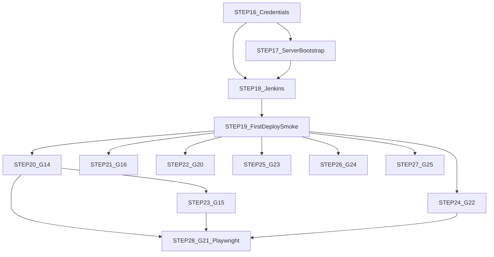

# HACCP — STEP 16 이후 에이전트 프롬프트 (배포 마감 · 잔여 G-ID)

> 저장소: `https://github.com/k971230/haccp` (public, main)  
> 작성일: 2026-08-10 · 개발자: 박승우  
> 선행: STEP 00–15 산출물은 main 반영됨. 본 문서는 **배포를 실제로 초록으로 닫는 운영 STEP**과 **배포 밖 잔여 G-ID**를 의존 순서로 고정한다.  
> 공통 헤더·금지사항: 기존 STEP 00–15 프롬프트 공통 헤더와 동일.  
> 정본 교차: [`20_배포_런북.md`](20_배포_런북.md) §12–§15·§19 · [`16_통합완성도_및_부족분.md`](16_통합완성도_및_부족분.md) · [`13_스모크_매트릭스.md`](19_스모크_매트릭스.md)

---

## 목차 · 실행 순서 (이 순서를 어기지 말 것)

| STEP | 묶음 | 목적 | 선행 | 병렬 |
|------|------|------|------|------|
| **16** | ops-A | 자격증명·시크릿 준비 | 15 완료 | 단독 |
| **17** | ops-B | 서버 `/opt/haccp` 1회 부트스트랩 | 16 | 단독 |
| **18** | ops-C | Jenkins Pipeline·Credentials·webhook | 16·17 | 단독 |
| **19** | ops-D | 첫 파이프라인 초록 + 수동 스모크 | 18 | 단독 |
| **20** | E / G-14 | 잔존 API 동결·폐기 결정 | 19 권장 | 19 후 |
| **21** | E / G-16 | 문서 06 vs 09 합본 정리 | 20과 병렬 가능 | docs |
| **22** | E / G-20 | BE docs 미러 인덱스 | 21과 병렬 가능 | docs |
| **23** | E / G-15 | BizOps 다중 base 문서·혼동 방지 | 20 후 | **완료** (2026-08-11) |
| **24** | E / G-22 | 멀티탭 로그아웃 확인·문서 | 19 후 | **완료** (2026-08-11) |
| **25** | E / G-23 | 그리드 pref·가상화 대량 스모크 | 19 후 | **완료** (2026-08-11) |
| **26** | E / G-24 | 서명 UX 가이드 | 19 후 | **완료** (2026-08-11) |
| **27** | E / G-25 | 법적서류 PDF/HWP 정책 확정 | 19 후 | **완료** (2026-08-11) |
| **28** | E / G-21 | Playwright E2E (최소 루프) | 20–27 권장 후 | **완료** (2026-08-11) |



**규칙**

1. **16 → 17 → 18 → 19** 는 엄격 순차. 시크릿 없이 17·18을 건너뛰면 실패한다.  
2. **20–28** 은 19(첫 배포 초록) 이후에만 착수. 문서만인 21·22는 19와 겹쳐도 되나, 운영 리스크상 19 완료 후를 기본으로 한다.  
3. **28 Playwright** 는 기능·정책 STEP(20–27)이 흔들린 뒤에 둔다.  
4. 에이전트는 시크릿 실값을 git에 쓰지 않는다. 사용자/ops가 Credentials·서버 파일로만 주입한다.  
5. G-12(오늘 할 일 Job)는 STEP 19 수동 확인에 포함하고, 실패 시 런북 §7 복구만 한다(별도 STEP 번호 없음).

---

## 공통 헤더 (STEP 16–28)

```
[역할] HACCP SaaS 저장소 https://github.com/k971230/haccp (main) 후속 STEP 에이전트.
[작업 전 필독]
  - docs/20_배포_런북.md
  - docs/21_후속_STEP_16이후.md (본 문서)
  - 16_통합완성도_및_부족분.md
  - 19_스모크_매트릭스.md
[금지사항]
  1. HTTP DELETE 금지 → POST validate-delete → POST delete
  2. body에 coCd/userId 금지
  3. 매직 넘버 금지
  4. 이모지 금지
  5. .env / .env.docker / PAT / SSH 키 커밋 금지
  6. 사용자 요청 없는 commit/push 금지
[완료 보고]
  1) 변경 파일 2) 수용조건 3) 검증 결과 4) 다음 STEP에 넘길 것 5) 커밋은 승인 후
```

---

# STEP 16 — 자격증명·시크릿 준비 (ops-A)

**목적**: Jenkins·GHCR·SSH·스모크에 넣을 비밀을 **준비만** 한다 (서버 배치·Job 등록은 17·18).  
**병렬**: 단독.  
**소요**: 30–60분 (사람 작업 비중 큼).

```
[프롬프트 시작]
역할: HACCP 시크릿 준비 에이전트 (값은 git에 쓰지 않음).

작업:
1. 런북 §12.1 Credentials 6종 체크리스트를 로컬 작업 노트(커밋 금지 경로)에 채울 빈 표를 만든다.
   - haccp-registry-cred : GHCR PAT — classic 스코프 write:packages, read:packages, delete:packages, repo
   - haccp-deploy-ssh-key : prod SSH private key
   - haccp-deploy-host : user@host 또는 host (예: ubuntu@<prod-ip>)
   - haccp-github-token : webhook·nightly gh issue
   - haccp-env-docker : Secret file — .env.docker 전체 (JWT·DB·CORS·rhwp·cron)
   - haccp-smoke-user : Username/password — 조회 전용 (결재·삭제 권한 금지)

2. Git Credential 의 gho_ 토큰은 write:packages 가 없음을 경고한다 (이미 실측됨).
   → 별도 classic PAT 발급이 필수. 아래 사용자 액션을 완료 보고에 체크한다.

   [사용자 액션] STEP 16 착수 시:
     github.com > Settings > Developer settings > Personal access tokens (classic)
     → Generate new token (classic)
     → 스코프: write:packages, read:packages, delete:packages, repo
     → 만료: 90일 이상
     → 발급 즉시 Jenkins Credentials(haccp-registry-cred)에 넣고 로컬 파일 저장 금지
     → 재발급 알림 90일 캘린더 등록

3. 스모크 계정 정책: ADMIN이 아닌 조회 전용 그룹. 런북 §15.

4. 산출물: docs/12 에 "STEP 16 체크 결과" 한 절을 추가하지 말고,
   완료 보고에만 "6종 준비 완료/미완" 표. 실값은 보고에 넣지 않음.

수용조건:
- 6종 각각 준비됨(또는 미완 ID 명시)
- GHCR PAT 사용자 액션(classic·4스코프·Jenkins 주입·로컬 미저장) 완료
- git status 에 시크릿 파일 없음
[프롬프트 끝]
```

---

# STEP 17 — 서버 `/opt/haccp` 부트스트랩 (ops-B)

**목적**: prod 호스트에 compose·env·볼륨·rhwp·인증서·DB migrate 1회.  
**선행**: STEP 16 (SSH·env 파일 준비).  
**소요**: 60–90분.

```
[프롬프트 시작]
역할: HACCP prod 서버 부트스트랩 에이전트.

작업 전 필독: 런북 §6·§9–§12·§14

작업:
0. [0단계 — 서버 준비 확인] (.env.docker 실배치·up 전에 통과해야 함. 미달 시 나머지 스텝 진행 금지 · 사용자에게 Docker/Compose 업그레이드 요청)
   docker --version                 # 24.0+ 권장
   docker compose version           # v2.20+ 필수 (env-file · profile 문법)
   # compose·env 파일이 /opt/haccp 에 준비된 뒤(또는 .env.docker.example 복사본으로):
   docker compose --env-file .env.docker -f docker-compose.prod.yml config >/dev/null
     → 환경변수 치환 후 최종 스펙 dry-run 검증 (실행 없이)
1. SSH로 접속 (BatchMode). /opt/haccp 생성.
2. .env.docker 배치 — root:root 0600. git/rsync로 시크릿 전송 금지(수동 scp 또는 out-of-band).
3. docker-compose.prod.yml · nginx/haccp.conf.template 배치 (이후 Jenkins rsync).
   → 배치 직후 0단계 config dry-run을 다시 통과시킨다.
4. bash scripts/init_volumes.sh · bash scripts/install_rhwp.sh
5. 인증서: gen_selfsigned.sh 또는 Let's Encrypt (런북 §10.4)
6. DB: 외부 PG면 DB_* 만 / 내부면 --profile with-db up 후
   docker compose --env-file .env.docker -f docker-compose.prod.yml --profile migrate run --rm migrate
7. 스모크 계정 DB 생성·권한 축소 (조회 전용)

수용조건:
- 0단계 docker / compose 버전·config dry-run 통과
- compose ps 핵심 서비스 healthy (또는 외부 DB 시 api/web/edge healthy)
- ls -l /opt/haccp/.env.docker → 0600
- rhwp --version 컨테이너 내 성공
[프롬프트 끝]
```

---

# STEP 18 — Jenkins 등록 (ops-C)

**목적**: Pipeline + audit job + Credentials + webhook.  
**선행**: 16(Credentials 값), 17(서버 SSH 가능).  
**소요**: 45–60분.

```
[프롬프트 시작]
역할: HACCP Jenkins 등록 에이전트.

작업 전 필독: 런북 §13.1 · Jenkinsfile · Jenkinsfile.audit

작업:
1. Multibranch 또는 Pipeline job — SCM=본 저장소, Script Path=Jenkinsfile
2. Credentials 6종 등록 (STEP 16 목록 ID 그대로)
3. GitHub webhook: https://<jenkins>/github-webhook/ · Push events
4. 별도 job: Jenkinsfile.audit (cron UTC 18:00)
5. Declarative Pipeline Linter로 Jenkinsfile 문법 확인
6. ansiColor 플러그인 없어도 동작함을 확인 (options에 없음 — 의도)

수용조건:
- Job 2개 존재 (deploy · audit)
- Credentials 6종 ID 일치
- Linter 오류 0
- 첫 빌드는 STEP 19에서 실행
[프롬프트 끝]
```

---

# STEP 19 — 첫 배포·스모크 검증 (ops-D)

**목적**: main 트리거 → GHCR push → migrate → deploy → prod_smoke 초록 + 수동 표.  
**선행**: 18.  
**소요**: 60–120분.

```
[프롬프트 시작]
역할: HACCP 첫 배포 검증 에이전트.

작업:
1. main 빈 커밋 또는 "Build now"로 파이프라인 1회 실행
2. 스테이지 전 구간 초록 확인 (Push·Prod migrate·Deploy·Prod smoke)
3. 런북 §6 env 체크리스트 전항 육안 확인
4. 브라우저: 로그인 · 메뉴 · 냉장 CCP 목록 · 법적서류(파일 없음 시 다운로드 비활성)
5. 19_스모크_매트릭스.md — 샘플 HWP 5종(07 §4.7 대표성) 전 컬럼
   - visitor-log (VISITOR_LOG) — 최단순 흐름
   - personal-hyg-hwp (PERSONAL_HYG) — DB→HWP 전환 대표
   - waste-hwp (WASTE) — 이관 그룹
   - verify-check-hwp (VERIFY_CHECK) — 검증 계열
   - edu-log-hwp (EDU_LOG) — 다른 모듈(EDU) 대표
   - CRUD 표에서 참조 차단 삭제 1건
6. G-12: 오늘 할 일 화면 — 비면 런북 §7 Job 복구 후 재확인
7. 실패 시 런북 §16 롤백 · §17 장애표

수용조건:
- Jenkins 콘솔 PROD SMOKE OK
- 위 샘플 HWP 5종 + 참조차단 1 판정 OK
- 실패 스테이지가 있으면 롤백 TAG 기록
[프롬프트 끝]
```

### STEP 19 완료 표기 (2026-08-11)

| 수용조건 | 판정 | 근거 |
|----------|------|------|
| Jenkins PROD SMOKE OK | OK | `haccp-deploy` #13 · TAG `1.0.13` |
| HWP 샘플 5종 + 참조차단 1 | OK | `13_스모크_매트릭스.md` STEP 19 기록 (VIEWER 쓰기 컬럼은 N-A) |
| 롤백 TAG | N-A | 실패 스테이지 없음 |
| §6 env · 브라우저 · G-12 · audit | OK | 런북 §20.1 |

**운영 마감(STEP 16–19) 종료. 다음 착수 = STEP 20 (G-14).**

### STEP 20 완료 표기 (2026-08-11)

| 결정 | 조치 | 근거 |
|------|------|------|
| smart-diary-* | **폐기** — BE Controller/Service/Mapper/XML 제거 | FE 참조 0 · UI 미노출 |
| audit-export | **동결 유지** — `@Deprecated(forRemoval=false)` | 규제·감사 대비 · FE 미노출 |
| audit-log | **미변경** | 변경 감사 로그 화면(별 기능) |
| DB `tbl_smart_diary_*` DROP | **미실시** (별도 승인 STEP) | 데이터 유실 위험 |

### STEP 21·22 완료 표기 (2026-08-11)

| STEP | G-ID | 결과 |
|------|------|------|
| 21 | G-16 | FE/BE 06 판정표 제거·요약화 · 00에 「09 유일 정본」합본 규칙 |
| 22 | G-20 | BE [`00_문서인덱스.md`](2_문서인덱스_BE.md) — FE 08/09/11·런북 미러 |

### STEP 23 완료 표기 (2026-08-11)

| 수용조건 | 판정 | 근거 |
|----------|------|------|
| 08 「API 잔존 · UI HWP」표 | OK | [`08` §5.7](15_HACCP_FE_BE_통합_상세스펙.md) |
| 07 갭/이관 교차 | OK | [`07` §6.4](14_메뉴_화면_API_DB_전수.md) ↔ §6.1·§4.7 |
| HWP 작성 UI에서 구 BizOps URL 호출 0 | OK | `HwpDocumentEditorPage` → documentApi만 · registry BizOps=FACILITY 1건 |
| 09 G-15 | OK | 완료(문서) · API 삭제는 별도 승인 |

### STEP 24 완료 표기 (2026-08-11)

| 수용조건 | 판정 | 근거 |
|----------|------|------|
| 로그아웃 broadcast · storage 경로 | OK | `clearAuthSession` → `broadcastAuthLogout` → `subscribeAuthCrossTab` → `handleUnauthorized` |
| Path basename 갭 수정 | OK | `authPaths.ts` · `loginBrowserPath`/`isLoginBrowserPath`/`toRouterPath` |
| 2탭 검증 | OK | vitest `authCrossTab`·`authPaths` + 수동 절차 [`04` §5.1](10_인증_보안_JWT_BE.md) |
| 09 G-22 | OK | 완료 · [`08` §3.4](15_HACCP_FE_BE_통합_상세스펙.md) |

### STEP 25 완료 표기 (2026-08-11)

| 수용조건 | 판정 | 근거 |
|----------|------|------|
| VITE_GRID_* 정본 | OK | VIRTUAL_THRESHOLD=활성 · PAGE_SIZE=예약(클라 페이징 없음) |
| 대량 화면 3+ | OK | 문서함·감사로그·설비이력 — MesEditableGrid→useGridVirtual·pref |
| 편차 표 · 09 G-23 | OK | [`08` §3.5](15_HACCP_FE_BE_통합_상세스펙.md) · 스모크 §5.5 |
| 크리티컬 버그 | 0 | vitest `shouldVirtualize` · `gridPref` |

### STEP 26 완료 표기 (2026-08-11)

| 수용조건 | 판정 | 근거 |
|----------|------|------|
| user sign API·UI 실측 | OK | 관리자 `users/{id}/sign` · 본인 `me/sign`·`me/sign-path` · HWP 클립보드 · CCP 행 경로 |
| 가이드 1절 | OK | [`11` §2.8](18_프레임워크_파일_보안_작성규칙.md) 등록·사용·실패 시 |
| 09 G-24 | OK | 완료(문서) · 코드 변경 없음 |
| 크리티컬 버그 | 0 | — |

### STEP 27 완료 표기 (2026-08-11)

| 수용조건 | 판정 | 근거 |
|----------|------|------|
| LegalDocumentUpload 현행 요약 | OK | 좌 form download · 우 첨부 download(PDF 우선) · 미리보기 없음 |
| 제품 결정 | **동결(의도)** | 인페이지 미리보기 재도입 = 별도 제품 STEP |
| 09 G-25 · 11 | OK | [`11` §2.9](18_프레임워크_파일_보안_작성규칙.md) · 코드 변경 없음 |

### STEP 28 완료 표기 (2026-08-11)

| 수용조건 | 판정 | 근거 |
|----------|------|------|
| 프레임워크 도입 | OK | STEP 28 명시 요청 · `@playwright/test` (haccp-web) |
| 시나리오 | OK | (1) 로그인→냉장→목록 **passed** · (2) 신규·상신은 write 계정 시 · SMOKE는 skip |
| 상신 실측 | OK | `haccp-write-user` 로 **2 passed · 0 skipped** (신규→저장→상신) — STEP 28 보강 |
| main 배포에 무거운 E2E 미강제 | OK | `Jenkinsfile` 미변경 · 선택 `Jenkinsfile.e2e`(`haccp-write-user`) |
| 시크릿 git 없음 | OK | `E2E_USER`/`E2E_PASS` env · `e2e/.env.example`만 |
| 09 G-21 | OK | 완료(상신 실측) · [`13` §5.8](../frontend/haccp-web/docs/13_스모크_매트릭스.md) |

**STEP 16–28 후속 트랙 종료.** 잔여는 운영 이슈·별도 제품 STEP.

---

# STEP 20 — G-14 잔존 API 동결·폐기 결정

**목적**: smart-diary-* · audit-export 등 동결 UI 잔존 API를 **유지(동결)** 또는 **폐기**로 결정·반영.  
**선행**: 19.  
**소요**: 45–90분.

```
[프롬프트 시작]
역할: HACCP 잔존 API 결정 에이전트.

작업 전 필독: 09 G-14 · 07 §6 · 08 API 표

[실측 결과 (2026-08-10, 본 문서 작성 시점)]
— grep 을 처음부터 다시 하지 말고 아래를 출발점으로 한다. 승인 전 DB DROP·코드 삭제 금지.

smart-diary-* 판정 근거:
  - FE 참조: 0 (grep -rn "smart-diary\|smartDiary" frontend/haccp-web/src)
  - BE 참조: WorkflowController.java (엔드포인트 — types/list · maps/list · map/save · map/delete)
               WorkflowService.java (smartDiaryTypes · smartDiaryMaps 등)
  - DB: tbl_smart_diary_* (24_ddl · 25_seed) + migrate 31/43/44 참조
  → 권장: 즉시 폐기 (Wave-A deprecate + Wave-B FE/BE/DB 삭제)
    삭제 대상:
      - BE: smartDiaryTypes / smartDiaryMaps 및 map save·delete 메서드·엔드포인트 4개
      - DB: 24_ddl_smart_diary.sql, 25_seed_smart_diary.sql 유지하되
             tbl_smart_diary_* 테이블 drop 마이그레이션 신설 or 후속 별도 STEP
             (DB 잔존은 데이터 유실 위험 — 사용자 승인 필수)

audit-export 판정 근거:
  - FE 참조: 0
  - BE 참조: TaskController.java (list · preview-pdf)
               TaskService.java (auditExport)
               DocumentService.java (zip 생성)
               SystemMapper.xml audit-log 는 별개 (변경 감사 · 유지)
               TaskMapper.xml sp_tbl_audit_export_r_000
  → 권장: 동결 유지 (감사 대비 · 폐기 시 규제 리스크)
    조치: BE @Deprecated 표시만, FE 미노출 유지, 09 G-14 상태 "동결 유지 확정"

[주의] audit-export 를 폐기해도 tbl_audit_log (SystemManagementPage의 audit-log 화면)는
      절대 건드리지 말 것. 두 개는 이름이 비슷할 뿐 완전히 다른 기능.
      - audit-export = 감사자료 zip 내보내기 (동결)
      - audit-log    = 변경 감사 로그 조회 화면 (완료 · 유지)

작업:
1. 위 실측을 기준으로 결정안 표 확정: smart-diary 폐기 / audit-export 동결 (사용자 승인)
2. 승인 후에만 코드·문서 반영 (승인 전 삭제·DROP 금지)
3. 09 G-14 상태 갱신 (smart-diary 폐기 진행 / audit-export 동결 유지 확정)

수용조건: 결정 문서화 + (승인 시) 코드/문서 일치 · tsc/compile 통과 · audit-log 미변경
[프롬프트 끝]
```

---

# STEP 21 — G-16 문서 06 vs 09 합본 정리

**목적**: 06 완료표와 09 판정 중복·시점 차이를 정리. **09를 판정 정본**으로 고정.  
**선행**: 19 권장. 20과 병렬 가능.  
**소요**: 40분.

```
[프롬프트 시작]
역할: HACCP 문서 합본 에이전트.

작업:
1. 06_업무_CRUD.md 와 09 중복 표 대조
2. 판정·P0/P1 상태는 09만 유지. 06은 요약·링크
3. 00 인덱스에 합본 규칙 한 줄 보강
4. 09 G-16 완료 표기

수용조건: 중복 판정표 제거 또는 "09 정본" 명시 · 코드 변경 없음
[프롬프트 끝]
```

---

# STEP 22 — G-20 BE docs 미러 인덱스

**목적**: BE docs에 FE 08/09/11·런북 링크만 보강 (두꺼운 복제 금지).  
**병렬**: 21과 가능.  
**소요**: 30분.

```
[프롬프트 시작]
역할: HACCP BE 문서 인덱스 에이전트.

작업:
1. `2_문서인덱스_BE.md` 에 인덱스 절 또는 00 대칭 짧은 파일
2. FE 08·09·11 · 루트 런북·본 STEP 문서 링크
3. 09 G-20 완료

수용조건: BE에서 통합 리뷰 입구 링크 동작 · 내용 복제 최소화
[프롬프트 끝]
```

---

# STEP 23 — G-15 BizOps 다중 base 혼동 방지

**목적**: fac/inv/prc API 잔존 vs HWP UI 이전을 08·07에 명확 표기. 불필요 API 삭제는 STEP 20 결정 따름.  
**선행**: 20.  
**소요**: 40분.

```
[프롬프트 시작]
역할: HACCP BizOps 문서화 에이전트.

작업:
1. 08에 "API 잔존 · UI HWP" 표 고정
2. 07 갭/이관 표와 교차
3. 작성 UI가 HWP인 화면에서 구 BizOps URL 호출 0 확인
4. 09 G-15 갱신

수용조건: 문서 표 완비 · 잘못된 FE 호출 0
[프롬프트 끝]
```

---

# STEP 24 — G-22 멀티탭 로그아웃

**목적**: HACCP auth 크로스탭 로그아웃이 MES F174 수준인지 확인·문서화·갭 수정.  
**선행**: 19.  
**소요**: 60분.

```
[프롬프트 시작]
역할: HACCP 멀티탭 세션 에이전트.

작업 전 필독: FE 04 · shell auth · 06-operations OPS_AUTH_CROSSTAB(MES 규약 참고)

작업:
1. 로그아웃 시 broadcast · storage 리스너 경로 추적
2. 2탭 수동 스모크: 한 탭 로그아웃 → 다른 탭 다음 API 401/로그인 화면
3. 갭 있으면 최소 수정 + 08/04 문서
4. 09 G-22 갱신

수용조건: 2탭 스모크 OK · 문서화
[프롬프트 끝]
```

---

# STEP 25 — G-23 그리드 pref·가상화 대량 스모크

**목적**: env 임계(가상화·페이지 크기)가 대량 화면에서 동작하는지 스모크·편차 기록.  
**선행**: 19.  
**소요**: 60분.

```
[프롬프트 시작]
역할: HACCP 그리드 대량 스모크 에이전트.

작업:
1. VITE_GRID_* · 런북/env 정본 확인
2. 대량 가능 화면 3개 이상(예: 문서함·감사로그·설비이력) 스크롤·pref 저장
3. 편차 표 → 09 G-23 (수정 필요 시 최소 패치)

수용조건: 스모크 결과 표 · 크리티컬 버그 0
[프롬프트 끝]
```

---

# STEP 26 — G-24 서명 UX 가이드

**목적**: 클립보드·업로드 서명 경로를 사용자/운영 가이드 한 절로 고정.  
**선행**: 19.  
**소요**: 40분.

```
[프롬프트 시작]
역할: HACCP 서명 UX 문서 에이전트.

작업:
1. user sign API·UI 경로 실측
2. FE docs 또는 런북 부록에 "서명 등록·실패 시" 절
3. 09 G-24 완료(문서)

수용조건: 가이드 1절 · 코드 변경은 버그 시에만
[프롬프트 끝]
```

---

# STEP 27 — G-25 법적서류 PDF/HWP 정책 확정

**목적**: 미리보기 제거·다운로드만인 현행을 **동결(의도)** 또는 **개선 티켓**으로 확정.  
**선행**: 19.  
**소요**: 30분.

```
[프롬프트 시작]
역할: HACCP 법적서류 정책 에이전트.

작업:
1. LegalDocumentUploadPage·form/download 현행 동작 요약
2. 제품 결정: 동결 OK / PDF 미리보기 필요(별도 STEP)
3. 09 G-25 · 11 관련 절 갱신

수용조건: 정책 한 줄 확정 · 동결이면 코드 변경 없음
[프롬프트 끝]
```

---

# STEP 28 — G-21 Playwright E2E (최소 루프)

**목적**: 로그인→메뉴→냉장 작성→상신 최소 E2E. 프레임워크는 기존 있으면 재사용, 없으면 승인 후 도입.  
**선행**: 20–27 권장 완료 후.  
**소요**: 120분+.

```
[프롬프트 시작]
역할: HACCP Playwright 스모크 에이전트.

작업 전: 사용자에게 테스트 프레임워크 신규 도입 승인 확인 (프로젝트 금지사항 7번).

작업:
1. 승인된 경우에만 Playwright(또는 기존 E2E) 최소 시나리오 1개
2. CI는 Jenkins 별 stage 또는 nightly — main 배포 파이프라인에 무거운 E2E 강제 금지(초기)
3. 09 G-21 갱신

수용조건: 로컬 1회 통과 · 시크릿은 env · git에 계정 없음
[프롬프트 끝]
```

---

## 부록 — 사용자/에이전트 분담

| STEP | 주로 |
|------|------|
| 16 | **사용자**(PAT·키 발급) + 에이전트(체크리스트 검증) |
| 17–18 | **사용자/ops** 서버·Jenkins UI + 에이전트(명령·검증) |
| 19 | 둘 다 (파이프라인 로그·브라우저) |
| 20–28 | 에이전트 주력 · 정책 결정은 사용자 승인 |

시크릿·SSH·Jenkins URL이 에이전트에 전달되기 전에는 STEP 16–18을 "문서·체크리스트만"으로 끝내고 실접속은 보류한다.
