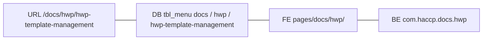

# 24 — URL = DB = 폴더 = 패키지 정본

개발자: 박승우  
일자: 2026-08-21

경로·라우팅 규칙의 **유일 정본**이다. 케밥·양식코드(`hwp_sys_*` 등)는 [`22_코드_케밥_양식매핑.md`](22_코드_케밥_양식매핑.md). 화면 전수 표는 [`14_메뉴_화면_API_DB_전수.md`](14_메뉴_화면_API_DB_전수.md).

---

## 1. 한 줄 핵심 규칙

브라우저 주소 `/haccp` 및 API `/api/v1` 바로 다음은 **대분류 / 중분류 / 소분류(`scrnCd`)** 순으로 일치시킨다.

한글 메뉴명은 URL에 절대 포함하지 않으며, `scrnCd`와 `persistId`는 어떠한 경우에도 변경하지 않는다.

Vite·Router basename은 `/haccp/` 이다. 라우터 pathname과 API 경로에는 `/haccp`를 다시 넣지 않는다.

---

## 2. 4층 1:1 동기화



| 구분 | 경로 / 식별자 | 비고 |
|------|----------------|------|
| URL | `/docs/hwp/hwp-template-management` | 화면 및 API 기본 엔드포인트 (`/api/v1` + 동일 칸) |
| DB (`tbl_menu`) | `docs` (대) → `hwp` (중) → `hwp-template-management` (소) | 대·중 `menu_cd` = URL 슬러그. 소 leaf `menu_cd` = `scrn_cd` |
| FE 소스 | `frontend/haccp-web/src/pages/docs/hwp/` | 화면 컴포넌트 위치 |
| BE 소스 | `com.haccp.docs.hwp` · `mapper/docs/hwp/` | 컨트롤러·패키지·MyBatis XML |

중 아래 화면이 하나면 `{메뉴}` 단을 생략한다. **이번에 손대는 메뉴**가 아직 평탄하면 그 작업에서 이 칸으로 옮긴다. 미리 전 메뉴를 나누지 않는다.

---

## 3. 대·중분류 전체 맵

라이브 목록은 FE [`tabRoute.ts`](../frontend/haccp-web/src/shell/tabRoute.ts) `SCREEN_PATH` 와 DB `tbl_menu` 이다.

| 대분류 (`menu_cd` / URL) | 중분류 (`menu_cd` / URL) | 비고 |
|--------------------------|--------------------------|------|
| `today-tasks` | (없음) | 최상위 Leaf 단독 화면 |
| `docs` | `ccp`, `prp`, `logis`, `admin`, `sch`, `hwp`, `html` | 문서 작성·기준관리 통합. 표시명 「문서」 |
| `docs` | `appr-hidden` | **대분류가 아니다.** `docs` 아래 숨김 중분류(`use_yn=N`). URL에 노출되지 않음. `flow`의 `appr`과 구분 |
| `flow` | `box`, `appr`, `ca` | 문서함, 전자결재, 개선조치. 표시명 「문서 현황·결재」 |
| `draft` | `hyg`, `ccp-chk`, `ccp-monitoring` | 양식 작성. 표시명 「양식 작성」 — HYG 양식·CCP 양식 형제 메뉴. 중분류는 `docs` 의 `html`·`ccp` 와 `menu_cd` 가 겹칠 수 없어 `hyg`·`ccp-chk` 를 쓴다 (`UNIQUE (co_cd, menu_cd)`). 자바 패키지는 하이픈 불가라 `ccp-chk` → `com.haccp.draft.ccp`, `ccp-monitoring` → `com.haccp.draft.ccpmonitoring` |
| `bas` | `master` | 기초정보 관리 |
| `sys` | `code`, `logs` | `code` = 공통코드·사이트/메뉴/권한·사용자·부서·결재선. `logs` = 감사로그·로그인·화면통계 |

---

## 4. 신규 화면 추가 체크리스트

- [ ] `tabRoute.ts` `SCREEN_PATH` 등록 (대/중/소 구조 준수)
- [ ] FE 컴포넌트 작성: `pages/{대}/{중}/{PageName}.tsx` (필요 시 `{메뉴}` 한 단)
- [ ] BE 컨트롤러 작성: `com.haccp.{대}.{중}.{Controller}` · `mapper/{대}/{중}/`
- [ ] DB `tbl_menu` 등록: 소분류 `menu_cd` = `scrnCd`
- [ ] 권한 적용 확인: `tbl_role_screen.scrn_cd` 기준 매핑 확인
- [ ] `shell/screenRegistry.tsx`에 `scrn_cd`와 동일 kebab 키 등록

---

## 5. 공유 API 허브 예외

다음 공용 엔티티 API는 화면 URL과 칸이 달라도 **기존 공용 경로를 유지**한다. 화면마다 복제하지 않는다.

| 경로 | 용도 |
|------|------|
| `/api/v1/docs/documents` | HWP leaf 및 문서함 공용 |
| `/api/v1/docs/templates/{tmplCd}/form` | 양식 원본 스트림 |
| `/api/v1/bas/company-templates` | 양식 삭제 공용 |
| `/api/v1/bas/{type}` | 기초정보 공용 마스터 |

셸 전용(화면 칸 밖): `/api/v1/auth` · `/menu` · `/code` · `/pref` · `/log`. 서명: `/api/v1/sys/users`.

---

## 6. DB 마이그레이션 및 이력

적용 SQL: [`db_sasshaccp/120_migrate_menu_url_slugs.sql`](../db_sasshaccp/120_migrate_menu_url_slugs.sql). 절차는 [`20_배포_런북.md`](20_배포_런북.md) §14.

- **수동 실행:** Jenkins는 migrate를 돌리지 않는다. 로컬·운영 모두 운영자가 120을 직접 실행해야 사이드바가 정본 코드로 갱신된다.
- **제약조건:** `UNIQUE (co_cd, menu_cd)` 때문에 대분류 2개 행을 동시에 `docs`로 UPDATE하지 않는다. 120은 한쪽을 개명하고 자식을 재부모한 뒤 빈 행을 지운다. `h_menu_cd`는 varchar이며 FK가 아니다.
- **권한:** `tbl_role_screen`은 `scrn_cd`를 쓰므로 `menu_cd` 개명에 따른 별도 UPDATE가 없다.
- **이력 보존:** `52` · `99` · `118` · `119`의 구 메뉴 코드는 수정하지 않는다. 120이 최종 덮어쓴다. 118·119를 이미 돌린 DB도 구 이름(`form`/`hwp`, `auth`/`code` 등)을 받아 한 방으로 맞춘다.
- **롤백 SQL은 없다.** 되돌리려면 dump 복원만 한다.

검증(120 커밋 후):

```sql
SELECT menu_cd, h_menu_cd, scrn_cd, menu_nm
  FROM sasshaccp.tbl_menu
 WHERE menu_cd IN ('docs','flow','bas','sys') OR menu_cd LIKE 'menu-doc-%';
-- 대분류 docs/flow/bas/sys 존재, menu-doc-write 등 구 대분류 0건
-- leaf: scrn_cd 있는 행은 menu_cd = scrn_cd
```

코드 검증(이미 수행): FE `npx tsc --noEmit` · BE `./mvnw -q -DskipTests compile` · `npx vitest run src/shell/tabRoute.test.ts`.

---

## 7. UX / 기획 · 배포 전

기존 사이드바의 「문서 작성」과 「문서 기준관리」가 「문서」 대분류 하나로 통합 노출된다. 기획·운영 조직에 사전 공유한다.

배포 전 체크:

- [ ] 로컬 DB에 120 수동 적용, 재로그인 후 사이드바 「문서」「문서 현황·결재」「기초정보」「시스템」
- [ ] 운영 DB에도 Jenkins가 아니라 수동으로 120 적용 (런북 §14)
- [ ] 커밋을 나눌 때: (1) FE·BE 폴더/패키지 이동 (2) 규칙·docs/24·런북·주석. 이 문서는 커밋을 강제하지 않는다.

---

## 8. 에이전트 인덱스

규칙 파일(`.cursor/rules/01` · `08` · `09`)에는 본문 복제 없이 **본 문서로 한 줄 링크**만 둔다.
