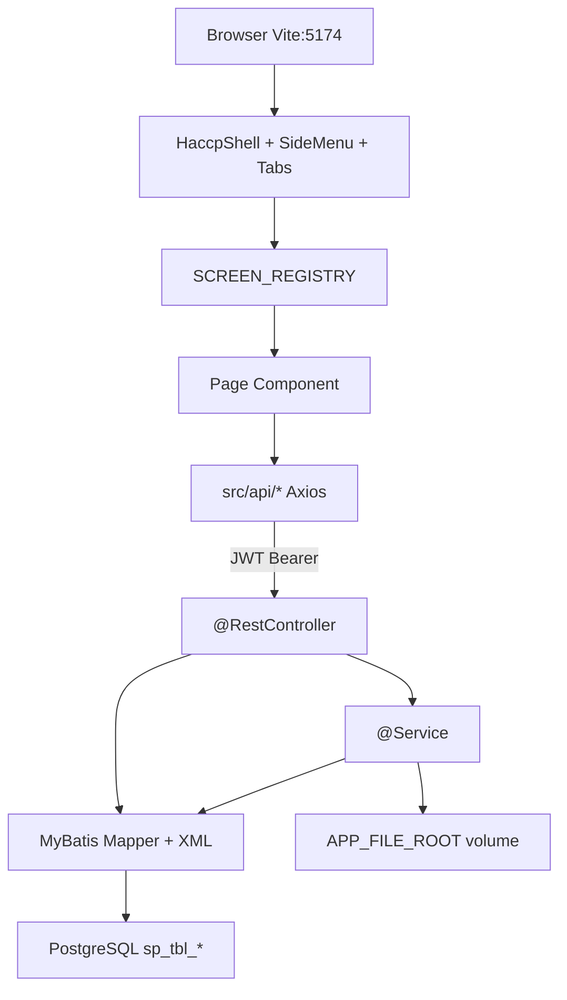
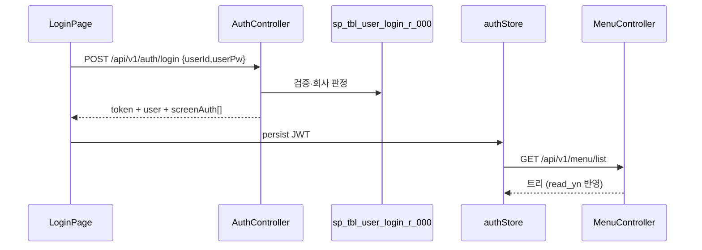
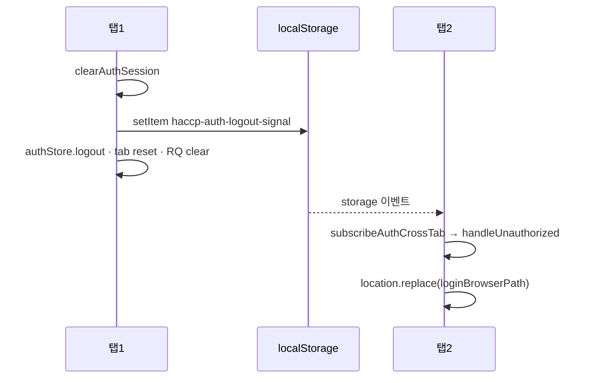
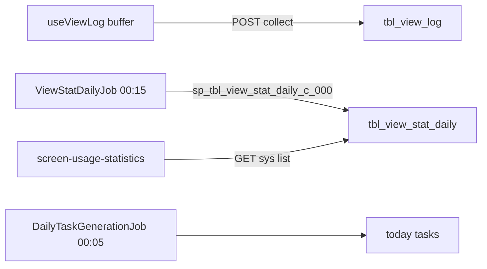

# HACCP FE·BE 통합 상세 스펙

> 정본: `frontend/haccp-web/docs/08_HACCP_FE_BE_통합_상세스펙.md`  
> 작성일: 2026-08-10 · 개발자: 박승우  
> 범위: **HACCP만** (`haccp-web` + `haccp-api` + `db_sasshaccp`). MES 제외.  
> 관련: [`00`](00_문서인덱스_및_통합리뷰.md) · [`01`](01_운영규칙.md) · [`04`](04_인증_보안_JWT.md) · [`06`](06_업무_CRUD.md) · [`07`](07_메뉴_화면_API_DB_전수.md) · [`09`](09_통합완성도_및_부족분.md) · [`10`](10_파일구조_컴포넌트_함수지도.md) · [`11` 파일·보안](11_프레임워크_파일_보안_작성규칙.md) · BE [`06`](../../../backend/haccp-api/docs/06_업무_CRUD.md)

---

## 0. 문서 목적·읽는 법

| 절 | 내용 |
|----|------|
| 1 | 스택·포트·환경변수 (버전 필수) |
| 2 | 런타임 아키텍처·요청 파이프라인 |
| 3 | 인증·권한·메뉴 로딩 |
| 4 | 패키지·디렉터리 지도 (FE/BE/DB) |
| 5 | FE API 함수 ↔ HTTP URL 전수 (§5.7 BizOps G-15) |
| 6 | BE Controller 엔드포인트 전수 |
| 7 | 화면 유형별 통합 계약 (Page→API→Controller→Mapper→SP→Table) |
| 8 | 문서·결재 상태 기계 |
| 9 | 파일 볼륨·rhwp·타임아웃 4중 방어 |
| 10 | 배치 Job·UV/PV |
| 11 | 운영 규약 (삭제·테넌트·응답) |
| 12 | 동결·갭·교차검증 |

메뉴 leaf 한 줄 표는 **07**이 정본이다. 본 문서는 **호출 체인·계약·환경**을 더 깊게 적는다.

---

## 1. 스택·포트·환경

### 1.1 버전 (필수 명시)

| 층 | 항목 | 버전 |
|----|------|------|
| FE | React / react-dom | **18.3.1** |
| FE | Vite | **5.4.8** |
| FE | TypeScript | 5.6.2 |
| FE | react-router-dom | 6.26.2 |
| FE | Zustand | 5.0.0 |
| FE | TanStack Query / Table / Virtual | 5.59.0 / 8.20.5 / 3.14.5 |
| FE | axios | 1.7.7 |
| FE | Tailwind | 3.4.17 |
| FE | @rhwp/editor | 0.8.2 |
| FE | Node | ≥20 |
| BE | Java | **17** |
| BE | Spring Boot | **3.3.4** |
| BE | MyBatis Spring Boot Starter | **3.0.3** |
| BE | PostgreSQL JDBC | 42.7.4 |
| BE | JJWT | 0.12.6 |
| DB | PostgreSQL DB·스키마 | `sasshaccp` / `sasshaccp` |
| DB | SP | `sp_tbl_{의미}_{r\|c\|d\|u}_000` |

### 1.2 포트·베이스 URL

| 프로세스 | 기본 | 비고 |
|----------|------|------|
| haccp-web (Vite) | `http://localhost:5174` | mes-web 5173과 분리 |
| haccp-api | `http://localhost:8081` | mes-api 8080과 분리 |
| FE→BE | `VITE_API_BASE_URL` | 기본 `http://localhost:8081` |

### 1.3 FE env (`frontend/haccp-web/.env.example`)

| 키 | 기본 | 용도 |
|----|------|------|
| VITE_API_BASE_URL | http://localhost:8081 | API 루트 |
| VITE_API_TIMEOUT_DEFAULT | 10000 | http (일반 CRUD) |
| VITE_API_TIMEOUT_BATCH | 60000 | httpBatch |
| VITE_API_TIMEOUT_FILE | 120000 | httpFile (HWP/PDF) |
| VITE_GRID_DEFAULT_PAGE_SIZE | 50 | 그리드 페이징 |
| VITE_GRID_VIRTUAL_THRESHOLD | 100 | 가상화 임계 |
| VITE_SEARCH_DEBOUNCE_MS | 300 | 검색 디바운스 |
| VITE_API_RETRY_COUNT | 2 | GET 재시도 |
| VITE_DASHBOARD_POLLING_MS | 10000 | 폴링 |
| VITE_VIEW_LOG_FLUSH_MS | 30000 | UV/PV 배치 전송 |
| VITE_TOAST_DURATION_MS | 2600 | 토스트 |
| VITE_TOAST_ERROR_DURATION_MS | 5000 | 오류 토스트 |

### 1.4 BE env (`backend/haccp-api/.env.example`)

| 키 | 용도 |
|----|------|
| SERVER_PORT | 8081 |
| DB_* / DB_URL | PG sasshaccp (`currentSchema=sasshaccp&escapeSyntaxCallMode=callIfNoReturn`) |
| HIKARI_* | 커넥션 풀 |
| TX_DEFAULT_TIMEOUT_SECONDS / MYBATIS_STATEMENT_TIMEOUT_SECONDS | 60 |
| JWT_SECRET / JWT_EXPIRE_MINUTES | HS512 ≥64B / 480분 |
| LOGIN_MAX_FAIL_COUNT | 5 |
| APP_TIMEZONE | Asia/Seoul |
| TASK_GENERATION_CRON | 0 5 0 * * * |
| VIEW_STAT_DAILY_CRON | 0 15 0 * * * |
| VIEW_STAT_DAILY_RUN_ON_STARTUP | false (로컬 스모크만 true) |
| CORS_ALLOWED_ORIGINS | http://localhost:5174 |
| APP_FILE_ROOT / APP_FILE_MAX_* | 파일 볼륨 |
| APP_TEMPLATE_* | 표준 HWP 볼륨·매니페스트 |
| APP_RHWP_* | CLI PDF 변환 |

---

## 2. 런타임 아키텍처



### 2.1 요청 파이프라인 (상세)

1. 브라우저 `/screen/{scrnCd}` → `tabRoute` → 셸 탭 open  
2. `isImplemented(scrnCd)` — 레지스트리 없으면 메뉴 비활성  
3. Page 마운트 → `PageScrnContext`에 scrnCd → `useAuthStore.can(scrnCd, write|modify|delete|…)`  
4. `usePageCommands` — 셸 상단 조회/신규/저장/삭제 (화면별 등록)  
5. API: `http` / `httpFile` / `httpBatch` + Bearer JWT  
6. BE: `JwtFilter` → Controller → (Service) → Mapper CALL/SELECT SP  
7. 응답: `CommonResponse<T>` `{ success, data, message }` · 예외는 `GlobalExceptionHandler` → 업무 문구  

### 2.2 FE 레이어

| 경로 | 역할 |
|------|------|
| `src/shell/*` | 셸·메뉴·탭·명령·뷰로그·다이얼로그 |
| `src/pages/*` | 화면 (도메인별) |
| `src/api/*` | REST 클라이언트 |
| `src/components/grid|form|document|layout|ui` | 공용 UI |
| `src/hooks/*` | useEditableRows · useGridAccess · useAsyncAction |
| `src/stores/authStore` | JWT·권한·can() |
| `src/config/envConfig.ts` | env 파싱 (매직넘버 금지) |

### 2.3 BE 레이어

| 패키지 | 역할 |
|--------|------|
| `auth` | 로그인·JWT·잠금 |
| `menu` `code` `pref` `log` | 셸 API (Controller→Mapper 직결 가능) |
| `bas` | 마스터·설비/방충 이력 |
| `workflow` | 결재선·양식·점검항목·주기·법적유형 |
| `ccp` `hyg` `ops` `doc` `tsk` `sys` | 업무 |
| `common` | LoginUserContext · BizException · DeleteValidation · response |

DI: `@RequiredArgsConstructor` + `private final`. CUD는 `@Transactional` (로그인 제외).

---

## 3. 인증·권한·메뉴

### 3.1 로그인 흐름



| API | FE | 비고 |
|-----|-----|------|
| POST `/api/v1/auth/login` | `authApi.login` | 공개 (JwtFilter 예외) |
| POST `/api/v1/auth/logout` | `authApi.logout` | 이력 |
| GET `/api/v1/auth/me` | `authApi.me` | 세션 복구 |

- 로그인: **아이디만** (회사는 서버 판정, MES와 다름)  
- JWT 클레임: coCd, coNm, userId, userNm, usrgrpCd, deptCd, deptNm, sid  
- 관리자: `usrgrpCd == "ADMIN"`  
- 연속 실패 → `LOGIN_MAX_FAIL_COUNT` 잠금  

### 3.2 화면 권한 5종

`tbl_role_screen`: read_yn · write_yn · modify_yn · delete_yn · print_yn  

| FE | 의미 |
|----|------|
| `can(scrn, "read")` | 메뉴 노출 (서버에서 이미 필터) |
| write | 행추가 |
| modify | 기존행 편집 |
| delete | 삭제 |
| print | 출력/PDF |

그리드 잠금: `useGridAccess` + Page rules (`*.rules.ts`).

### 3.3 메뉴 로딩

| 단계 | 구현 |
|------|------|
| DB | tbl_menu (co_cd) JOIN 권한 |
| SP | `sp_tbl_menu_r_000` |
| API | GET `/api/v1/menu/list` |
| FE | `menuApi` → `SideMenu` |
| 구현 여부 | `isImplemented(scrnCd)` ← SCREEN_REGISTRY |

회사 생성: `sp_tbl_company_init_c_000` — `tbl_screen.use_yn=Y` AND module ∈ {WRK,APR,FRM,COD,SYS}.

IA 대메뉴: today-tasks + MWRK / MAPR / MFRM / MCOD / MSYS (migrate 36).

### 3.4 멀티탭 로그아웃 (G-22 · MES F174)

MES `OPS_AUTH_CROSSTAB`과 동일 패턴. 키 접두만 `haccp-*` (MES `mes-*`와 혼용 금지).



| 단계 | 파일 · 심볼 | 비고 |
|------|-------------|------|
| 수동 로그아웃 | `HaccpShell.onLogout` → `logoutApi` → `clearAuthSession` → `nav("/login")` | Router basename 상대 |
| 신호 송신 | `broadcastAuthLogout` | **항상 localStorage** (자동로그인 OFF·sessionStorage여도 신호는 local) |
| 신호 키 | `AUTH_LOGOUT_SIGNAL_KEY=haccp-auth-logout-signal` | `authKeys.ts` |
| 2차 감지 | `AUTH_STORAGE_KEY=haccp-auth` 삭제·토큰 공백 | 신호 유실 대비 |
| 구독 | `main.tsx` → `subscribeAuthCrossTab` | 로그인 화면이면 no-op (`isLoginBrowserPath`) |
| 타 탭 정리 | `handleUnauthorized` | `authPaths.loginBrowserPath` 로 replace — **Vite base `/haccp/` 정합** |
| 복귀 URL | `toRouterPath` 후 `saveReturnUrl` | browser `/haccp/...` → 라우터 `/...` |

**Path 갭(STEP 24 수정):** 하드코딩 `location.replace("/login")`·`pathname === "/login"` 은 Apache Path 배포에서 `/haccp/login` 과 불일치 → 타 탭이 잘못된 origin 경로로 튕기거나 중복 처리됨. `shell/authPaths.ts` 로 통일.

**검증:** `npm test` — `authPaths.test.ts` · `authCrossTab.test.ts`. 수동 2탭: 동일 계정 로그인 → 탭1 로그아웃 → 탭2가 `/haccp/login`(또는 로컬 `/login`)으로 이동·이후 API는 미인증.

판정: [`09` G-22](09_통합완성도_및_부족분.md).

---

## 4. 디렉터리 지도

### 4.1 FE pages

| 폴더 | 화면 |
|------|------|
| pages/auth | LoginPage |
| pages/tsk | TodayTasksPage |
| pages/sys | SystemManagementPage (+rules) |
| pages/bas | MasterData · Equipment/Pest History · ApprovalLine · Schedule · TemplateCheckItem · HwpTemplate |
| pages/ccp | Cold · Generic · Metal · Verification · CcpFormPage |
| pages/hyg | HygieneCheck · HealthCert |
| pages/ops | BizOpsFormPage |
| pages/doc | HwpDocumentEditor · DocumentBox · LegalDocumentUpload · CorrectiveAction |

### 4.2 FE api (19)

authApi · menuApi · codeApi · prefApi · viewLogApi · http  
systemApi · masterApi · equipmentHistApi · pestDeviceHistApi · workflowApi  
documentApi · hygieneApi · healthCertApi · ccpColdApi · ccpFormsApi · ccpGenericApi · bizOpsApi · taskWorkflowApi

### 4.3 BE java 패키지 ↔ mapper XML

동일 도메인명: `src/main/java/com/metis/haccp/{pkg}` ↔ `resources/mapper/{pkg}/*.xml`

### 4.4 DB

| 번호대 | 내용 |
|--------|------|
| 00~08 | schema · ddl · indexes |
| 09~10 | seed |
| 11~22 | SP |
| 23~47 | migrate (IA·문서·admin·legal·viewstat 관련) |

---

## 5. FE API 함수 ↔ HTTP 전수

### 5.1 셸·공통

| FE 함수 | Method | URL | 클라이언트 |
|---------|--------|-----|------------|
| auth login/logout/me | POST/POST/GET | `/api/v1/auth/*` | http |
| menu list | GET | `/api/v1/menu/list` | http |
| code list | GET | `/api/v1/code/list?mainCd=` | http |
| pref grid list/save | GET/PUT | `/api/v1/pref/grid/{list,save}` | http |
| collectViewLogs | POST | `/api/v1/log/view/collect` | http (실패 무시) |

### 5.2 systemApi

| FE | Method | URL |
|----|--------|-----|
| listSystemRows(screenCode) | GET | `/api/v1/sys/{screenCode}/list` |
| saveSystemRows | PUT | `/api/v1/sys/{screenCode}/save` |
| validateDeleteSystemRows | POST | `/api/v1/sys/{screenCode}/validate-delete` |
| deleteSystemRows | POST | `/api/v1/sys/{screenCode}/delete` |
| uploadUserSign / uploadMySign | POST multipart | `/api/v1/sys/users/{id\|me}/sign` |
| fetchMySignPath | GET | `/api/v1/sys/users/me/sign-path` |

screenCode: company/user/department/role/menu/common-code-management · login-history · screen-usage-statistics · audit-log  
(이력 3종은 list만)

### 5.3 masterApi · 이력

| FE | URL |
|----|-----|
| list/save/validate/delete Master | `/api/v1/bas/{type}/*` type=product\|material\|partner\|storage\|equipment\|measuring-device\|pest-device\|vehicle\|work-area\|ccp-limit |
| equipment photo | POST `/api/v1/bas/equipment/{idx}/photo` |
| equipmentHist list/save/del | `/api/v1/bas/equipment-hist/*` |
| pestDeviceHist list/save/del | `/api/v1/bas/pest-device-hist/*` |

### 5.4 workflowApi

| FE | URL |
|----|-----|
| approval-lines CRUD | `/api/v1/bas/approval-lines/{list,save,validate-delete,delete}` |
| company-templates | list/save/validate-delete/delete · create-custom(multipart) |
| saveLegalType | PUT `/api/v1/bas/legal-types/save` |
| company-check-items | list?tmplCd · save · validate-delete · delete |
| company-forms | list · clone · activate · form-items list/save |
| schedule-rules | list/save/validate-delete/delete |
| template-export-hist | list · get · export · import |
| ~~smart-diary~~ | **폐기** (STEP 20 / G-14) — BE 엔드포인트 제거. DB DROP은 별도 승인 |

### 5.5 documentApi

| FE | URL | 클라이언트 |
|----|-----|------------|
| listDocumentTemplates | GET `/api/v1/doc/templates/list` | http |
| loadHwpTemplateFile(formUrl) | GET formUrl | httpFile blob |
| saveHwpTemplateForm | POST `/api/v1/doc/templates/{tmplCd}/form` | httpFile |
| listDocuments | GET `/api/v1/doc/documents/list` | http |
| listApprovalInbox/History | GET `…/approval-inbox` · `…/approval-history` | http |
| getDocumentDetail | GET `…/documents/{docIdx}` | http |
| saveHwpDocument | PUT `…/documents/hwp/save` | http |
| uploadDocumentFile | POST `…/{docIdx}/files` | httpFile |
| downloadDocumentFile | GET `…/files/{fileIdx}/download` | httpFile |
| exportDocumentPdf | POST `…/{docIdx}/export-pdf` | httpFile |
| processDocumentApproval | PUT `…/documents/approval` | http |
| validate/delete Document | POST validate-delete · delete | http |
| fetchMySignImage | GET `/api/v1/sys/users/me/sign` | httpFile |

### 5.6 작성 도메인 API

| 모듈 | FE | Base |
|------|-----|------|
| hygieneApi | list/detail/save/validate/delete | `/api/v1/hyg/{screenCode}/*` |
| healthCertApi | list/save/del + upload file | `/api/v1/hyg/health-cert/*` |
| ccpColdApi | list/detail/save/del | `/api/v1/ccp/cold-monitor/*` |
| ccpFormsApi | list/detail/save/del | `/api/v1/ccp/{metal-monitor\|verification-check\|annual-verification-plan}/*` |
| ccpGenericApi | templates · get · save · del | `/api/v1/ccp/generic-monitor/*` |
| bizOpsApi | list/detail/save/del | `/api/v1/fac|inv|prc/{screen}/*` — **작성 UI는 `facility-equipment-check`만**. 나머지 base는 API 잔존(§5.7) |
| taskWorkflowApi | today-tasks · notifications · corrective · relations · audit-export(동결) | `/api/v1/tsk/*` · `/api/v1/doc/corrective-actions/*` |

### 5.7 BizOps 다중 base — API 잔존 · UI HWP (G-15)

`BizOpsController`는 아래 **6 base × (list/detail/save/validate-delete/delete)** 를 한 컨트롤러에 묶는다.
메뉴·레지스트리와 혼동하지 말 것: **활성 작성 UI는 FACILITY DB 1건뿐**이고, 이관된 화면은 `documentApi`(+rhwp)만 호출한다.

| screenCode (구 DB) | API base | BE 상태 | FE 작성 UI | 활성 scrn_cd / tmpl | 비고 |
|--------------------|----------|---------|------------|---------------------|------|
| `facility-equipment-check` | `/api/v1/fac/facility-equipment-check` | 잔존·사용 | `BizOpsFormPage` | `facility-equipment-check` / FACILITY | **유일 활성 BizOps DB 작성** |
| `calibration-target-management` | `/api/v1/fac/calibration-target-management` | API 잔존 | 없음 (레지스트리 미등록) | use_yn=N | 숨김 · HWP 대체 leaf 없음(자체/외부 검교정은 `calib-*-hwp`) |
| `waste-disposal-check` | `/api/v1/fac/waste-disposal-check` | API 잔존 | HWP 이전 | `waste-hwp` / WASTE | 구 DB 화면 use_yn=N |
| `inventory-check` | `/api/v1/inv/inventory-check` | API 잔존 | HWP 이전 | `inventory-hwp` / INV_CHECK | 구 DB 화면 use_yn=N |
| `receiving-inspection` | `/api/v1/inv/receiving-inspection` | API 잔존 | HWP 이전 | `receiving-insp-hwp` / RECV_INSP | 구 DB 화면 use_yn=N |
| `process-control-check` | `/api/v1/prc/process-control-check` | API 잔존 | HWP 이전 | `process-hwp` / PROCESS | 구 DB 화면 use_yn=N |

**FE 호출 검증 (STEP 23, 2026-08-11)**

| 검사 | 결과 |
|------|------|
| `screenRegistry` → `BizOpsFormPage` | `facility-equipment-check` **1건만** |
| HWP leaf (`waste-hwp` · `inventory-hwp` · `receiving-insp-hwp` · `process-hwp`) | `HwpDocumentEditorPage` → `documentApi` · `systemApi`(서명)만. `bizOpsApi` / `/api/v1/fac|inv|prc/` **호출 0** |
| `BizOpsFormPage` meta에 남은 5 screenCode | 코드 잔존(재활성 대비)이나 **메뉴·레지스트리 경로 없음** → 운영 작성 경로에서 미도달 |
| 불필요 API 삭제 | **미실시** — STEP 20과 동일하게 별도 승인 후(데이터·SP 의존). 현행은 문서 고정으로 혼동만 제거 |

메뉴·이관 한 줄 표 교차: [`07` §6.1·§6.4](07_메뉴_화면_API_DB_전수.md). 판정: [`09` G-15](09_통합완성도_및_부족분.md).

---

## 6. BE Controller 엔드포인트 전수

### 6.1 요약 표

| Controller | Base | 메서드 수(대략) |
|------------|------|----------------|
| AuthController | /api/v1/auth | 3 |
| MenuController | /api/v1/menu | 1 |
| CodeController | /api/v1/code | 1 |
| PrefController | /api/v1/pref/grid | 2 |
| ViewLogController | /api/v1/log/view | 1 |
| MasterController | /api/v1/bas | 5 |
| EquipmentHistController | /api/v1/bas/equipment-hist | 4 |
| PestDeviceHistController | /api/v1/bas/pest-device-hist | 4 |
| WorkflowController | /api/v1/bas | 30+ |
| CcpColdController | /api/v1/ccp/cold-monitor | 5 |
| CcpGenericController | /api/v1/ccp/generic-monitor | 5 |
| CcpFormsController | /api/v1/ccp/{form} | 5 |
| HygieneController | /api/v1/hyg/{screenCode} | 5 |
| HealthCertController | /api/v1/hyg/health-cert | 5 |
| DocumentController | /api/v1/doc/documents | 11 |
| TemplateController | /api/v1/doc/templates | 3 |
| TaskController | (full path) | 11 |
| SystemController | /api/v1/sys | 8 |
| BizOpsController | 6 bases × 5 | 30 |

합계: **@RestController 19**.

### 6.2 DocumentController 상세

| Method | Path | 역할 |
|--------|------|------|
| GET | /list | 문서함·작성 목록 |
| GET | /approval-inbox | 내 차례 결재 |
| GET | /approval-history | 결재·변경 이력 |
| GET | /{docIdx} | 상세(헤더·결재·파일·버전) |
| PUT | /hwp/save | HWP 헤더 저장 → docIdx |
| POST | /{docIdx}/files | 첨부 multipart (HWP_SRC/PDF/ATTACH/PHOTO) |
| POST | /{docIdx}/export-pdf | rhwp CLI 변환 |
| GET | /files/{fileIdx}/download | 다운로드 |
| PUT | /approval | REQUEST/REVIEW/APPROVE/REJECT/CANCEL |
| POST | /validate-delete · /delete | OPS_DELETE |

### 6.3 WorkflowController 상세 그룹

- approval-lines · company-templates · **legal-types/save** · company-check-items  
- company-forms / form-items / clone / activate  
- schedule-rules · ~~smart-diary-*~~(STEP 20 폐기) · template-export-hist · audit-export(동결)  

---

## 7. 화면 유형별 통합 계약

### 7.1 유형 분류

| 유형 | FE Page | FE API | BE | 대표 SP/테이블 |
|------|---------|--------|-----|----------------|
| A 시스템 CRUD | SystemManagementPage | systemApi | SystemController | 21_sp_system · tbl_company/user/… |
| B 시스템 이력 | 동일 readOnly | systemApi list | SystemController | login_log · view_stat_daily · audit_log |
| C 기초 마스터 | MasterDataPage | masterApi | MasterController | sp_tbl_master_* |
| D CCP 한계 admin | MasterDataPage | masterApi ccp-limit | MasterController | sp_tbl_ccp_limit_* |
| E 설비/방충 이력 M-D | Equipment/Pest HistoryPage | master+hist API | Master+HistController | equipment_hist / pest hist |
| F 결재선·주기·점검항목 | ApprovalLine · Schedule · TemplateCheckItem | workflowApi | WorkflowController | 18_sp_workflow |
| G HWP 양식관리 | HwpTemplateManagementPage | document+workflow | Template+Workflow | company_template · form file |
| H 위생 DB | HygieneCheckPage | hygieneApi | HygieneController | sp_tbl_hygiene_document_* |
| I 냉장 CCP | ColdMonitorPage | ccpColdApi | CcpColdController | sp_tbl_ccp_cold_monitor_* |
| J 금속/검증 CCP | CcpFormPage | ccpFormsApi | CcpFormsController | sp_tbl_ccp_form_* |
| K 가열·멸균·여과 | CcpGenericMonitorPage | ccpGenericApi | CcpGenericController | generic monitor SP |
| L 시설점검 DB | BizOpsFormPage | bizOpsApi | BizOpsController | sp_tbl_biz_ops_* FACILITY (**활성 1건**, §5.7) |
| M 건강진단 | HealthCertPage | healthCertApi | HealthCertController | sp_tbl_health_cert_* |
| N HWP leaf | HwpDocumentEditorPage | documentApi | Document+Template | document · hwp_document_c (폐기물·재고·입고·공정 등 구 BizOps 이관 포함) |
| O 문서함/결재 | DocumentBoxPage | documentApi | DocumentController | document list/inbox |
| P 법적서류 M-D | LegalDocumentUploadPage | document+workflow | Template+Document+Workflow | legal_type · templates · documents |
| Q 개선조치 | CorrectiveActionManagementPage | taskWorkflowApi | TaskController | corrective_action |
| R 오늘할일 | TodayTasksPage | taskWorkflowApi | TaskController | today_task |

### 7.2 작성 화면 공통 UI 체인 (DB형)

```
Page
 ├─ DocFormSearchToolbar (기간·문서번호·작성자)
 ├─ DocFormLayout / DocPaper / DocCell*
 ├─ MesEditableGrid (항목 행)
 ├─ DocumentApprovalToolbar (writerActionsOnly: 상신·취소)
 ├─ DocDeviationFooter (이탈·개선)
 └─ usePageCommands(add/save/del/search)
```

권한: PageScrnContext scrn_cd. 결재 검토·승인은 **결재함**만.

### 7.3 HWP leaf 체인

```
hwpLeaf(tmplCd) → HwpDocumentEditorPage
 ├─ 목록 MesEditableGrid (tmpl 고정 필터)
 ├─ rhwp editor (@rhwp/editor)
 ├─ saveHwpDocument → uploadDocumentFile(HWP_SRC)
 ├─ exportDocumentPdf (선택)
 └─ DocumentApprovalToolbar (상신·취소)
```

양식 원본: GET/POST `/api/v1/doc/templates/{tmplCd}/form` (form_path 없으면 400 — 법적유형은 formUrl 생략).

### 7.4 법적서류 M-D 체인

| 패널 | FE | BE |
|------|-----|-----|
| 좌 양식 | saveLegalType · saveHwpTemplateForm · company-templates delete · templates form download | Workflow legal-types · Template form · company-templates |
| 우 문서 | saveHwpDocument · uploadDocumentFile · downloadDocumentFile · document delete | DocumentController |
| 셸 Cmds | search만 (CRUD는 패널 GridCrudButtons) | — |

### 7.5 마스터·이력 삭제 키

| 리소스 | validate/delete Body |
|--------|----------------------|
| master | `[{ idx }]` 또는 타입별 키 |
| equipment-hist / pest-hist | `[{ idx }]` |
| approval-lines | `[{ apprLineCd }]` |
| company-templates | `[{ tmplCd }]` |
| company-check-items | `[{ tmplCd, itemCd }]` |
| schedule-rules | `[{ idx }]` |
| documents / ccp / hyg / bizops | `[{ docIdx }]` |
| health-cert | `[{ idx }]` |
| corrective | `[{ idx }]` |

규칙: **객체 배열** · 스칼라 배열 금지 · FE·BE 양쪽 assertDeletable(더블체크).

---

## 8. 문서·결재 상태 기계

### 8.1 status 코드

| 코드 | 의미 |
|------|------|
| WRK | 작성중 |
| REQ | 검토요청(상신) |
| REV | 검토완료 |
| APV | 승인완료 |
| RJT | 반려 |

### 8.2 approval action (PUT `/documents/approval`)

| action | 결과 상태(요지) | 누가 |
|--------|-----------------|------|
| REQUEST | WRK/RJT → REQ | 작성자 |
| CANCEL | REQ → WRK (서명 후 차단 등 SP 33) | 작성자 |
| REVIEW | REQ → REV | 검토자 |
| APPROVE | → APV | 승인자 |
| REJECT | → RJT | 검토/승인 |

정본 SP: `sp_tbl_document_approval_c_000` (`15_sp_doc.sql` + migrate **33**).

### 8.3 작성 vs 결재 UI

| 화면 | 툴바 |
|------|------|
| 작성 DB/HWP | writerActionsOnly — 상신·취소 |
| approval-inbox | 검토·승인·반려 |
| document-inbox | 상신·취소 + 「작성화면」 deep-link |

Deep-link: `/screen/{scrnCd}?docIdx=` — `documentNav.ts` (tmplCd→scrnCd).

---

## 9. 파일 볼륨·rhwp·타임아웃

### 9.1 볼륨 레이아웃 (개념)

```
APP_FILE_ROOT/
  _template/           # 표준·회사 양식 HWP (DB에 바이너리 없음)
    {한글파일}.hwp
    {coCd}/…
  {coCd}/
    documents/{docIdx}/…
    signs/{userId}…
    equipment photos…
```

- TemplateImportService(ApplicationRunner): APP_TEMPLATE_IMPORT_ROOT + manifest.tsv  
- formPath는 서버 전용 — API는 formUrl만  

### 9.2 타임아웃 4중 방어 (배치 60s 기준)

1. FE httpBatch/File timeout (env) — 배치 60s · 파일 120s  
2. Nginx `proxy_read_timeout` — 일반 `/api/` **70s**, 파일·PDF 경로 **130s**  
   (`nginx/haccp.conf.template`, 배포 런북 §10.2)  
3. Spring `@Transactional(timeout=60)`  
4. MyBatis `default-statement-timeout: 60`  

파일: FE 120s · rhwp CLI `APP_RHWP_TIMEOUT_SECONDS` 110 · Nginx Grace(파일) 130s.

### 9.3 MesButton variant (FE)

search(blue) · add(amber) · save(blue) · danger(red) · excel(emerald) · **download(indigo)** · secondary/ghost.

---

## 10. 배치 Job·UV/PV



| Job | cron | Service |
|-----|------|---------|
| DailyTaskGenerationJob | TASK_GENERATION_CRON | TaskService.generateAllCompanies |
| ViewStatDailyJob | VIEW_STAT_DAILY_CRON | ViewStatService.aggregateYesterdayAndToday |

수집 실패는 업무를 막지 않음 (ViewLogController warn만).

---

## 11. 운영 규약 (HACCP 적용)

| 규약 | 내용 |
|------|------|
| OPS_DELETE | HTTP DELETE 금지 · validate→delete · Body 객체배열 · BE Double Check |
| 테넌트 | co_cd/user_id 요청 본문 금지 — LoginUserContext만 |
| 응답 | CommonResponse · SP CALL 건수 미반환 |
| 에러 | 사용자=업무문구 / 로그=기술상세 |
| 매직넘버 | env / application.yml / envConfig만 |
| 인수인계 주석 | FE=BE 동일 밀도 (40-handoff) |
| 이모지 | 소스·UI·문서 금지 |

---

## 12. 동결·갭·검증

### 12.1 동결 (의도적 미노출)

- ~~스마트일지 유형~~ — **API 폐기 완료** (STEP 20). DB `tbl_smart_diary_*` DROP은 후속 승인  
- 감사추출 UI (TaskController `audit-export` **동결 유지** · `@Deprecated` · FE 미노출) — `audit-log`와 별개  
- 범용 template-check-item-management (use_yn=N)  
- 단독 hwp-document-editor 메뉴  
- LAW/EDU/TST 개별 leaf  

### 12.2 알려진 갭

상세·우선순위·백로그는 **[`09_통합완성도_및_부족분.md`](09_통합완성도_및_부족분.md)** 정본.

| ID | 항목 | 상태 |
|----|------|------|
| G-01 | approval-history | FE O · DEMO 메뉴 leaf 없을 수 있음 |
| G-03 | migrate 47 이중 파일 | 적용 순서 주의 |
| G-13 | MasterData equipment/pest · ccpMetal/VerificationApi | **완료** — 2026-08-10 STEP 01 삭제 |
| G-15 | BizOps 다중 base 혼동 | **완료(문서)** — 2026-08-11 STEP 23. §5.7 표 · HWP 경로 bizOps 호출 0 |
| G-22 | 멀티탭 로그아웃 | **완료** — 2026-08-11 STEP 24. §3.4 · `authPaths` Path basename |

### 12.3 교차 수치

| 항목 | 수 |
|------|-----|
| SCREEN_REGISTRY | 75 |
| @RestController | 19 |
| FE api 모듈 | 19 |
| Mapper XML | 19 |
| 활성 IA 대메뉴 | 5 + today-tasks |

### 12.4 검증 체크리스트

- [ ] React 18.3.1 · MyBatis 3.0.3 · Boot 3.3.4 · Vite 5.4.8 · Java 17 본문 존재  
- [ ] FE 함수명 ↔ URL §5와 Controller §6 일치  
- [ ] 삭제 Body 복합키 배열  
- [ ] 작성 화면 결재 버튼 = 상신·취소만  
- [ ] 메뉴 leaf 상세 표는 07 참조  

---

## 부록 A. 공통 응답·DTO 스케치

```ts
// CommonResponse<T>
{ success: boolean; data: T; message?: string }

// DocumentListRow (요지)
{ docIdx, tmplCd, tmplNm, docKind: "DB"|"HWP", docNo, baseDt, status, verNo, fileCnt, … }

// DocumentFileRow.fileKind
"HWP_SRC" | "PDF" | "ATTACH" | "PHOTO"

// ViewLogItem
{ scrnCd, enterDt, leaveDt?, refScrnCd? }
```

## 부록 B. 화면코드 레지스트리 75키

`today-tasks`, 시스템 8, 기초 8, 기준·admin·이력, WRK DB/HWP, APR 5 — 전체 나열은 [`07 §9.1`](07_메뉴_화면_API_DB_전수.md) 정본.

## 부록 C. HWP fixedTmplCd (27)

visitor-log→VISITOR_LOG … surface-test-hwp→SURFACE_TEST — 07 §4.7 정본.

---

*본 문서는 HACCP FE+BE+DB 통합 상세 스펙이다. 메뉴 한 줄 매트릭스는 07, CRUD 갭은 06을 본다.*
