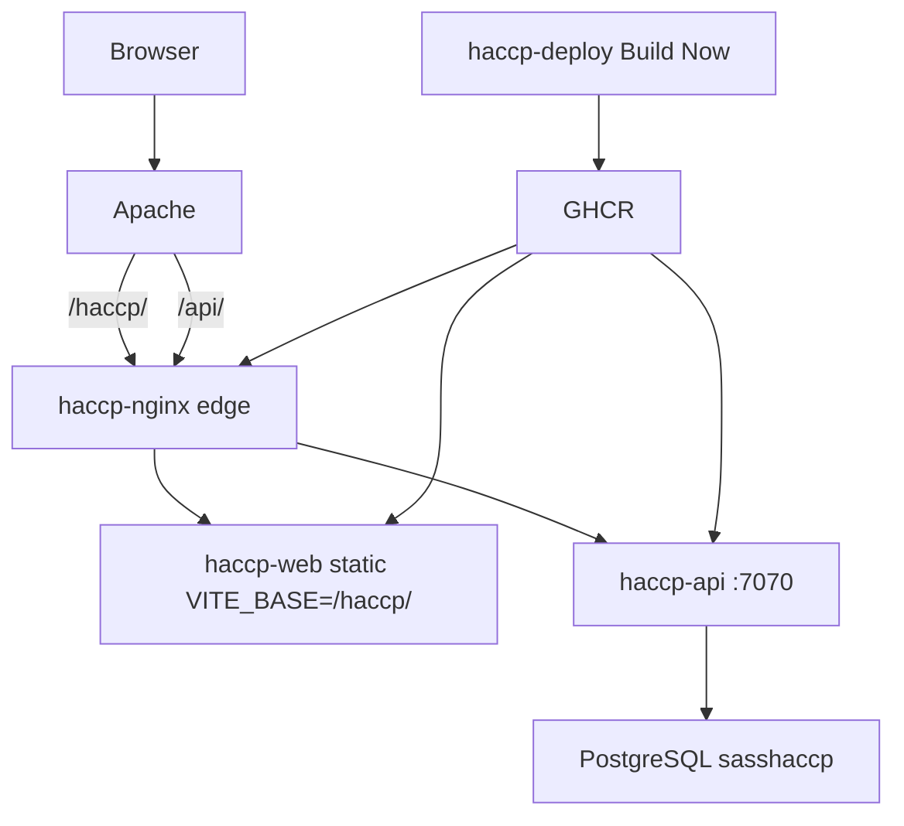
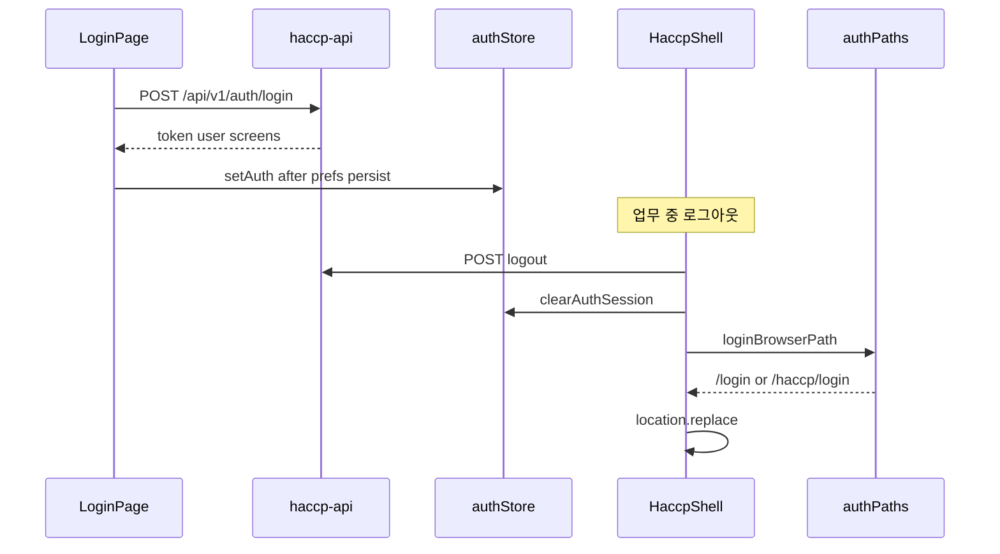

# HACCP SaaS — 타 AI 리뷰용 종합 보고서 (`완성.md`)

> 작성 목적: 이 문서 하나만 Claude/ChatGPT 등에 넣어도 **개발 맥락·프롬프트 대응·핵심 최종 코드**를 이해하고 코드 리뷰·프롬프트 개선 인사이트를 낼 수 있게 한다.  
> 작성 시점: 2026-08-11 · 저장소 `https://github.com/k971230/haccp`  
> 대화 트랜스크립트: Cursor agent `6b1efffb-16c7-4b3c-9d2f-8f8d03f3aa5a`  
> 시크릿 실값·비밀번호·PAT·SSH 키는 **의도적으로 제외**했다.

**소스 범위 고지:** 모노레포 전 파일 덤프는 비현실적이므로, Path/로그인/포트/Jenkins에 직결된 모듈은 **전문 또는 핵심 함수 전체**로 넣고, CRUD·SP·그리드 전수는 경로로 위임한다. 리뷰 시 해당 경로를 저장소에서 열면 된다.

---

## 1. 프로젝트 개요

### 1.1 목적

HACCP(식품안전관리인증) **기록·결재·보관 SaaS**. MES(`metis`) 모노레포에서 HACCP만 분리한 **public** 저장소다. DB·스키마는 MES와 공유하지 않는 **`sasshaccp`**, SP는 `sp_tbl_*`만 사용한다.

### 1.2 핵심 기능

| 영역 | 내용 |
|------|------|
| 인증 | JWT 로그인(회사 콤보 없음·아이디로 테넌트 판정), 아이디 저장/자동 로그인, 멀티탭 로그아웃 |
| 셸 | 사이드 메뉴·다중 탭·화면 조회 로그(UV/PV) |
| 업무 | CCP 모니터링, 위생, 문서/HWP·PDF, 결재, 마스터, 시스템 관리 등 |
| 배포 | Docker 이미지 → GHCR → Jenkins `haccp-deploy` → Apache Path `/haccp/` |
| 감시 | Jenkins `haccp-audit` 야간 규약 검사(배포 아님) |

의도적 미구현: ERP 연동, 바코드.

### 1.3 기술 스택

| 층 | 스택 |
|----|------|
| FE | React 18, Vite 5, TypeScript, Tailwind, Zustand, React Query — `frontend/haccp-web/` |
| BE | Spring Boot 3.3.4, Java 17, MyBatis 3.0.3, JWT — `backend/haccp-api/` |
| DB | PostgreSQL · `sasshaccp` · `db_sasshaccp/` 번호 SQL |
| 인프라 | Docker, nginx edge, Apache Path, Jenkins, GHCR `ghcr.io/k971230/haccp-*` |

### 1.4 현행 포트·URL (코드 기준)

| 환경 | 값 |
|------|-----|
| 로컬 Vite | **4173** (`strictPort: true`) |
| 로컬 API | **7070** |
| CORS 기본 | `http://localhost:4173` |
| 운영 Path | `https://180.71.58.87/haccp/` (`VITE_BASE=/haccp/`) |
| edge publish 예 | `127.0.0.1:17070:7070` |
| Jenkins 배포 디렉터리 | `/home/ubuntu/haccp` (`DEPLOY_DIR`) |

### 1.5 문서 진입점

| 파일 | 역할 |
|------|------|
| [`환경구축.md`](환경구축.md) | 도구·DB·로컬 기동 · **Jenkins 설치·Credentials·Job** |
| [`개발.md`](개발.md) | 브랜치·FE/BE 규약·인증·검증 |
| [`운영.md`](운영.md) | Build Now·스테이지·스모크·장애 |
| [`docs/12_배포_런북.md`](docs/12_배포_런북.md) | 배포 정본 |
| `frontend/haccp-web/docs/` · `backend/haccp-api/docs/` | 앱 상세 스펙 |

참고: docs를 `1_`~`21_`로 모으는 PR **#15는 OPEN**. main의 문서 경로는 위 표가 현행이다.

---

## 2. 대화 및 프롬프트 대응 타임라인

대화는 2026-08-10 ~ 08-11, 배포 STEP 킥오프부터 루트 핸드북·본 보고서까지다.

| 회차 | 사용자 요청 요지 | AI 전략·결과 | 주요 산출물 |
|------|------------------|--------------|-------------|
| STEP 00 | 루트 `docs/12_배포_런북.md` 킥오프(브랜치·커밋·PR·시크릿) | Plan→실행, feature 브랜치 | 배포 런북 뼈대 |
| STEP 01 | FE dead code 제거(G-13), 참조 0 확인 후 삭제 | grep 검증 후 삭제 | `ccpMetalApi` 등 제거 |
| STEP 02–14 | migrate·compose·Jenkins·시크릿·스모크 | 단계별 PR·런북 이력 갱신 | CI/CD 골격 |
| STEP ops (#1–4) | Apache Path `/haccp`, edge 17070, smoke MSYS 깨짐, SMOKE URL | Windows Git Bash path 보정 | PR #1–#4 머지 |
| STEP 18–19 | Jenkins Job·prod smoke 정합 | Credentials·Build Now 정책 문서화 | 런북 §13.1 |
| STEP 20–27 | G-14~G-25 문서·코드 동결/수정 | 문서 PR·소수 코드 fix | PR #5–#11 머지 |
| STEP 24 | 멀티탭 로그아웃 Path basename | `authPaths` + `handleUnauthorized` | PR #8 머지 |
| STEP 28 | Playwright 최소 E2E | e2e 브랜치 | PR #12 OPEN |
| 정리 파동 | docs 모음, 포트 4173/7070, migrate CI 제거 논의, scripts/rules 정리 | 별도 브랜치·PR | PR #13–#15 OPEN |
| 로그인 UI | MES 스플릿·HACCP 로고·RMA favicon·logout `/haccp`·5174→4173 | 터미널 `cp`, `loginBrowserPath`, main 머지+Jenkins Build Now | **PR #16 머지** |
| Jenkins 교육 | deploy vs audit, 대기열 없음 | Build Now 필수·webhook 불가 설명 | 운영 이해 정착 |
| 핸드북 | 루트 `환경구축`·`개발`·`운영` (Jenkins 구축 절 보강) | 역할 분리 문서 | **PR #17 OPEN** |
| 본 요청 | 타 AI용 `완성.md` | 메타 보고서·핵심 코드 전문 | 본 파일 |

사용자 제약(반복 강제): 한국어, 이모지 금지, main 직커밋 금지, 시크릿 미커밋, Plan 파일 미수정, Windows `;`, FE·BE 인수인계 주석 동일 밀도, 커밋/PR은 명시 요청 시.

---

## 3. 프롬프트 대응 및 엔지니어링 분석

### 3.1 지시문 해석 패턴

1. **장문 STEP 프롬프트** (`[프롬프트 시작]` … 작업 전 필독 문서): 범위·금지·완료 조건을 체크리스트로 분해 후 feature 브랜치에서 최소 diff.
2. **Plan mode**: 계획만 작성 → 사용자 승인/`Implement the plan` 후에만 파일 수정. plan 파일 자체는 편집 금지.
3. **모호한 운영 질문** (“대기 목록이 없는데?”): 코드(`githubPush`)와 런북(localhost webhook 불가)을 대조해 **Build Now**로 해석.
4. **UI 에셋**: “터미널로 복사” 명시 → `cp`로 MES/`assets` → `src/static/img`·`public`.

### 3.2 제약 준수

| 제약 | 준수 방식 |
|------|-----------|
| 시크릿 | Credentials ID·경로만 문서화, 값 금지 |
| 브랜치 | `feature/*` → PR → main |
| Path `/haccp` | `VITE_BASE`, `loginBrowserPath`, favicon `%BASE_URL%` |
| MES 분리 | DB/SP/포트(4173 vs 5173) 분리 유지 |
| 인수인계 주석 | LoginPage prop·authPaths JSDoc 밀도 유지 |

### 3.3 오류·맥락 복구

| 문제 | 원인 | 대응 |
|------|------|------|
| `npm run dev` → 5174 | 로그인 브랜치를 main에서 분기해 ports PR 미포함 | 동 브랜치에 4173/`strictPort`·CORS·7070 흡수 |
| 로그아웃 URL에 `haccp` 없음 | `nav("/login")` + 빌드 base 이슈 | `location.replace(loginBrowserPath())` |
| 머지 후 Jenkins 대기열 공백 | webhook 미연결 | “Build Now 없으면 서버 불변” 명시 |
| Git Bash가 `/haccp`를 Windows 경로로 변환 | MSYS | 스모크·SSH에 `MSYS_NO_PATHCONV` / `//home/...` |

### 3.4 맥락 유지 전략

- 대화 요약 핸드오프 + 런북·`.cursor/rules` 부트스트랩 선행.
- “우리 했던 것”을 핸드북·본 보고서에 타임라인으로 고정.
- 미머지 PR(#15 docs 모음, #12 e2e)은 **OPEN으로 명시**해 drift를 숨기지 않음.

### 3.5 프롬프트 엔지니어링 관찰 (타 AI 평가용)

- 강점: STEP 프롬프트가 문서 G-ID·필독 경로·완료 정의를 구체화 → 에이전트 일탈 감소.
- 약점: 동일 장문 프롬프트 반복으로 토큰 비용 큼. 핸드북 3종 이후에는 **“환경구축 §11 따라 Job 등록”**처럼 짧은 지시로 충분.
- Plan↔Execute 왕복이 잦음 → 단순 문서/복사는 Agent 직행이 더 효율적일 수 있음.

---

## 4. 최종 결과물 및 아키텍처

### 4.1 운영 토폴로지



### 4.2 인증·로그아웃 데이터 흐름



### 4.3 모듈 맵 (리뷰 우선순위)

| 모듈 | 경로 | 역할 |
|------|------|------|
| Login UI | `frontend/haccp-web/src/pages/auth/LoginPage.tsx` | MES 스플릿·로고·로그인 로직 |
| Path 헬퍼 | `frontend/haccp-web/src/shell/authPaths.ts` | basename 절대 로그인 경로 |
| 세션 | `frontend/haccp-web/src/shell/authSession.ts` | 401·`handleUnauthorized` |
| 셸 로그아웃 | `frontend/haccp-web/src/shell/HaccpShell.tsx` | `loginBrowserPath` replace |
| Vite | `frontend/haccp-web/vite.config.ts` | 4173 · base |
| favicon | `frontend/haccp-web/index.html` | `%BASE_URL%logo2.svg` |
| 에셋 | `src/static/img/login_bg.png`, `haccp_logo.png` · `public/logo2.svg` |
| Jenkins 배포 | `Jenkinsfile` | TAG·migrate·deploy·smoke |
| Jenkins 감사 | `Jenkinsfile.audit` | nightly 4 scripts |
| 핸드북 | `환경구축.md` · `개발.md` · `운영.md` | 온보딩 |

CRUD·메뉴 전수: `frontend/haccp-web/docs/07_*.md`, `08_*.md` · BE `docs/06_*.md` · SQL `db_sasshaccp/`.

### 4.4 Jenkins Job

| Job | Script | 역할 |
|-----|--------|------|
| `haccp-deploy` | `Jenkinsfile` | BE/FE → dry-run → images → migrate → deploy → smoke |
| `haccp-audit` | `Jenkinsfile.audit` | drift/DELETE/filesize/docs links — **배포 안 함** |

트리거(현재): localhost → **Build Now만**. `githubPush()`는 webhook 없으면 큐 미생성.

Credentials ID(값 없음): `haccp-registry-cred`, `haccp-deploy-ssh-key`, `haccp-deploy-host`, `haccp-github-token`, `haccp-env-docker`, `haccp-smoke-user`.

### 4.5 PR 상태 (보고서 작성 시점)

| PR | 상태 | 제목 |
|----|------|------|
| #16 | **MERGED** | 로그인 MES 스플릿·HACCP 로고·/haccp 로그아웃·로컬 4173 |
| #17 | **OPEN** | 루트 환경구축·개발·운영 핸드북 (+본 `완성.md` 예정) |
| #15 | OPEN | docs 1_~21_ 모음·ports·migrate CI 제거 등 |
| #12–14 | OPEN | e2e·scripts·docs chore |

---

### 4.6 핵심 소스 — `vite.config.ts` (전문)

```ts
// frontend/haccp-web/vite.config.ts
import react from "@vitejs/plugin-react";
import path from "path";
import { fileURLToPath } from "url";
import { defineConfig } from "vite";

const __dirname = path.dirname(fileURLToPath(import.meta.url));

export default defineConfig({
  base: process.env.VITE_BASE || "/",
  plugins: [react()],
  resolve: {
    alias: { "@": path.resolve(__dirname, "./src") },
  },
  server: {
    port: 4173,
    host: "localhost",
    strictPort: true,
    proxy: {
      "/rhwp": {
        target: "https://edwardkim.github.io",
        changeOrigin: true,
        secure: true,
      },
    },
  },
  test: {
    globals: true,
    environment: "jsdom",
    include: ["src/**/*.test.ts", "src/**/*.test.tsx"],
  },
});
```

### 4.7 핵심 소스 — `authPaths.ts` (전문)

```ts
// frontend/haccp-web/src/shell/authPaths.ts
export function normalizeAppBaseUrl(
  baseUrl: string = import.meta.env.BASE_URL || "/"
): string {
  const trimmed = (baseUrl || "/").trim() || "/";
  return trimmed.endsWith("/") ? trimmed : `${trimmed}/`;
}

export function loginBrowserPath(baseUrl?: string): string {
  return `${normalizeAppBaseUrl(baseUrl)}login`;
}

export function isLoginBrowserPath(
  pathname: string,
  baseUrl?: string
): boolean {
  const login = loginBrowserPath(baseUrl);
  return pathname === login || pathname === `${login}/`;
}

export function toRouterPath(
  browserPathAndSearch: string,
  baseUrl?: string
): string {
  const baseNoSlash = normalizeAppBaseUrl(baseUrl).replace(/\/$/, "");
  const q = browserPathAndSearch.indexOf("?");
  const path = q >= 0 ? browserPathAndSearch.slice(0, q) : browserPathAndSearch;
  const search = q >= 0 ? browserPathAndSearch.slice(q) : "";

  let routerPath = path;
  if (baseNoSlash && (path === baseNoSlash || path.startsWith(`${baseNoSlash}/`))) {
    routerPath = path.slice(baseNoSlash.length) || "/";
  }
  if (!routerPath.startsWith("/")) routerPath = `/${routerPath}`;
  return `${routerPath}${search}`;
}
```

### 4.8 핵심 소스 — `HaccpShell.onLogout`

```ts
// frontend/haccp-web/src/shell/HaccpShell.tsx (발췌)
const onLogout = async () => {
  await logoutApi();
  clearAuthSession();
  // 401·멀티탭과 동일 — basename 누락 시 /login 으로 떨어지는 것을 막는다 (/haccp/login)
  location.replace(loginBrowserPath());
};
```

### 4.9 핵심 소스 — `LoginPage.tsx` (전문)

저장소 파일과 동일. 회사 콤보 없음 · MES 스플릿 · `haccp_logo` · prefs/login 흐름.

```tsx
/**
 * LoginPage — 아이디·비밀번호 로그인 화면.
 * PIPELINE[HF115]
 */
import { useEffect, useState } from "react";
import { useLocation, useNavigate } from "react-router-dom";
import { useQueryClient } from "@tanstack/react-query";
import { login } from "@/api/authApi";
import { applyAuthPersistStorage, useAuthStore } from "@/stores/authStore";
import { toUserMessage } from "@/shell/errors";
import { isTokenValid, resolvePostLoginPath } from "@/shell/authSession";
import { loadLoginPrefs, saveLoginPrefs } from "@/shell/loginPrefs";
import { useAsyncAction } from "@/hooks/useAsyncAction";
import { cn } from "@/lib/cn";
import { loginInputClass } from "@/components/ui/Input";
import loginBg from "@/static/img/login_bg.png";
import haccpLogo from "@/static/img/haccp_logo.png";

function initialLoginForm() {
  const prefs = loadLoginPrefs();
  const hasSavedId = prefs.saveId && !!prefs.userId;
  return {
    userId: hasSavedId ? (prefs.userId ?? "") : "",
    saveId: prefs.saveId,
    autoLogin: prefs.autoLogin,
  };
}

export function LoginPage() {
  const nav = useNavigate();
  const loc = useLocation();
  const setAuth = useAuthStore((s) => s.setAuth);
  const token = useAuthStore((s) => s.token);
  const qc = useQueryClient();
  const { run, isBusy } = useAsyncAction();
  const returnFrom = (loc.state as { from?: string } | null)?.from;

  const [formInit] = useState(initialLoginForm);
  const [userId, setUserId] = useState(formInit.userId);
  const [password, setPassword] = useState("");
  const [saveId, setSaveId] = useState(formInit.saveId);
  const [autoLogin, setAutoLogin] = useState(formInit.autoLogin);
  const [err, setErr] = useState<string | null>(null);
  const busy = isBusy("login");

  useEffect(() => {
    if (isTokenValid(token)) {
      nav(resolvePostLoginPath(returnFrom), { replace: true });
    }
  }, [token, returnFrom, nav]);

  const onSubmit = (e: React.FormEvent<HTMLFormElement>) => {
    e.preventDefault();
    setErr(null);
    const uid = userId.trim();
    const pwd = password.trim();
    if (!uid || !pwd) {
      setErr("아이디와 비밀번호를 입력해 주세요.");
      return;
    }
    void run(
      async () => {
        const res = await login({ userId: uid, password: pwd });
        saveLoginPrefs({ saveId, autoLogin, userId: saveId ? uid : undefined });
        applyAuthPersistStorage(autoLogin);
        qc.clear();
        setAuth(res.token, res.user, res.screens);
        nav(resolvePostLoginPath(returnFrom), { replace: true });
      },
      "login",
      (ex) => setErr(toUserMessage(ex, "로그인에 실패했습니다.")),
    );
  };

  return (
    <div className="flex min-h-screen min-h-[100dvh] flex-col lg:flex-row">
      <section className="relative order-2 min-h-[200px] flex-1 overflow-hidden lg:order-1 lg:min-h-screen">
        
      </section>
      <section className="order-1 flex w-full shrink-0 items-center justify-center bg-white px-6 py-10 sm:px-10 lg:order-2 lg:w-[min(480px,46%)] lg:min-h-screen lg:px-12">
        <div className="w-full max-w-[340px]">
          <header className="mb-8 flex justify-center">
            
          </header>
          <form className="space-y-4" onSubmit={onSubmit}>
            {/* 아이디·비밀번호·체크박스·에러·CTA — 저장소 파일에 prop 주석 밀도 유지 */}
            <div>
              <label className="mb-1.5 block text-sm font-medium text-slate-700" htmlFor="login-user-id">아이디</label>
              <input id="login-user-id" className={loginInputClass} value={userId}
                onChange={(e) => setUserId(e.target.value)} placeholder="아이디"
                autoComplete="username" autoFocus required />
            </div>
            <div>
              <label className="mb-1.5 block text-sm font-medium text-slate-700" htmlFor="login-password">비밀번호</label>
              <input id="login-password" className={loginInputClass} type="password" value={password}
                onChange={(e) => setPassword(e.target.value)} placeholder="비밀번호"
                autoComplete="current-password" required />
            </div>
            <div className="flex flex-wrap items-center gap-x-5 gap-y-2 pt-1">
              <label className="flex cursor-pointer items-center gap-2">
                <input type="checkbox" className="h-4 w-4 cursor-pointer accent-[#1a3676]"
                  checked={saveId} onChange={(e) => setSaveId(e.target.checked)} />
                <span className="text-sm text-slate-600">아이디 저장</span>
              </label>
              <label className="flex cursor-pointer items-center gap-2">
                <input type="checkbox" className="h-4 w-4 cursor-pointer accent-[#1a3676]"
                  checked={autoLogin} onChange={(e) => setAutoLogin(e.target.checked)} />
                <span className="text-sm text-slate-600">자동 로그인</span>
              </label>
            </div>
            {err && <p className="text-sm font-medium text-rose-600">{err}</p>}
            <button type="submit" disabled={busy} className={cn(
              "mt-2 flex h-12 w-full items-center justify-center rounded-lg bg-[#1a3676] text-sm font-semibold text-white transition",
              "hover:bg-[#152d63] active:translate-y-px",
              "focus:outline-none focus:ring-2 focus:ring-[#1a3676]/30",
              "disabled:cursor-not-allowed disabled:opacity-60",
            )}>
              {busy ? "로그인 중" : "로그인"}
            </button>
          </form>
        </div>
      </section>
    </div>
  );
}
```

(주석 전체 밀도는 저장소 `LoginPage.tsx` 242줄 버전이 정본.)

### 4.10 Jenkinsfile 스테이지 요약

```
Checkout → BE test & compile → FE test & build
  → DB migrate dry-run → Build images → Push images
  → Prod DB migrate → Deploy to prod → Prod smoke
```

`TAG=1.0.${BUILD_NUMBER}`, `SMOKE_WEB_PREFIX=/haccp`, `DEPLOY_DIR=/home/ubuntu/haccp`.  
migrate 제거 논의는 PR #15 — **머지 전엔 위 스테이지가 정본**.

---

## 5. 자체 평가 및 한계점

### 5.1 잘된 점

1. Path basename을 `authPaths`로 한곳에 모아 401·멀티탭·수동 로그아웃이 동일 경로를 씀.
2. 로컬 4173 ↔ CORS ↔ API 7070을 코드·env.example·핸드북에 맞춤.
3. Jenkins를 “설치(환경구축)”와 “일상 Build Now(운영)”로 분리해 대기열 오해를 줄임.
4. 공개 저장소에서 시크릿을 Credentials/서버 파일로만 두는 규약이 일관됨.
5. MES UI 정렬 시 **로직(회사 콤보 없음)** 은 유지하고 레이아웃만 맞춤.

### 5.2 에지 케이스·리스크

| 항목 | 설명 |
|------|------|
| 문서 drift | PR #15 미머지 → `docs/12_` vs 예정 `docs/20_`, FE `*/docs` 잔존 |
| migrate vs DBeaver | CI Prod migrate가 운영 수동 스키마와 충돌할 수 있음 |
| `githubPush` 잔존 | 파일에 트리거가 있어 “자동 배포”로 오해하기 쉬움 |
| Windows 에이전트 | `mvnw`·MSYS path — 이미 여러 ops PR로 봉합했으나 재발 가능 |
| 완성.md 범위 | 업무 CRUD/SP 전량 미포함 — 타 AI는 추가 clone 필요 |

### 5.3 성능·토큰

- 장문 STEP 프롬프트 반복은 컨텍스트를 비대하게 만듦 → 이후는 핸드북 절 번호 지시 권장.
- Plan 모드 왕복은 안전하지만 문서 전용 작업에는 과도할 수 있음.
- 인수인계 주석 밀도는 온보딩에 유리·diff 노이즈·토큰 비용 증가 트레이드오프.

---

## 6. 후속 AI 분석 가이드 (체크리스트)

타 AI는 아래를 **우선 평가**하고, 가능하면 저장소를 clone한 뒤 경로를 열어 검증할 것.

### 6.1 Path·인증

- [ ] Docker 웹 빌드 `VITE_BASE=/haccp/` 와 `BrowserRouter basename` 일치
- [ ] 로그아웃·401이 모두 `loginBrowserPath()`를 쓰는지 (`nav("/login")` 잔존 검색)
- [ ] favicon이 `%BASE_URL%logo2.svg` 인지 (절대 `/logo2.svg` 금지)
- [ ] `authPaths.test.ts` 경계 (`/`, `/haccp/`) 충분한지

### 6.2 로컬 포트

- [ ] `vite.config.ts` 4173 + `strictPort`
- [ ] `CORS_ALLOWED_ORIGINS` · `VITE_API_BASE_URL=http://localhost:7070`
- [ ] 문서/주석에 5174·8081 잔존 여부 (drift)

### 6.3 운영 규약

- [ ] HTTP DELETE 금지 · validate-delete/delete 쌍
- [ ] API 타임아웃 3계층 + Nginx/Spring/MyBatis 방어
- [ ] 사용자 메시지 vs 서버 로그 분리 (`SqlUserMessage` / `errors.ts`)

### 6.4 Jenkins·배포

- [ ] Build Now 정책과 `githubPush` 문서 정합
- [ ] Credentials ID 문자열 일치
- [ ] migrate 단계 유지 vs PR #15 제거 — **어느 쪽이 팀 정본인지**
- [ ] `DEPLOY_DIR` `/home/ubuntu/haccp` vs 런북 `/opt/haccp` 서술 혼선

### 6.5 프롬프트·프로세스

- [ ] STEP 프롬프트 길이 축소안 (핸드북 링크형)
- [ ] OPEN PR(#12–15,#17) 정리·머지 우선순위
- [ ] main 직커밋 금지 준수 이력

### 6.6 보안

- [ ] git에 `.env`·토큰 없음
- [ ] 공개 문서에 접속정보 과다 노출 여부 (호스트 IP는 이미 런북에 존재 — 정책 판단)

---

## 7. 작성 에이전트 피드백 요약 (요청: “피드백 줘”)

1. **배포·Path·Jenkins 교육 루프는 성공적**이다. 특히 “머지 ≠ 배포”와 `loginBrowserPath` 수정은 운영 사고를 직접 줄이는 타입이다.  
2. **문서 이중 구조(PR #15 미머지 + FE/BE docs + 루트 핸드북)** 가 다음 부채 최대 리스크다. #15/#17을 정리하지 않으면 타 AI·신규 인력도 잘못된 경로를 읽는다.  
3. **프롬프트는 이미 핸드북으로 압축 가능**하다. 이후 STEP은 G-ID·금지 3줄 + `개발.md` §링크면 충분하고, 장문 복붙은 토큰 낭비다.  
4. 코드 리뷰 초점은 CRUD 전량보다 **Path/타임아웃/DELETE/시크릿/Windows CI** 다섯 축이 ROI가 높다.

---

## 부록 A — 저장소에서 바로 열 경로

```
frontend/haccp-web/src/pages/auth/LoginPage.tsx
frontend/haccp-web/src/shell/authPaths.ts
frontend/haccp-web/src/shell/authSession.ts
frontend/haccp-web/src/shell/HaccpShell.tsx
frontend/haccp-web/vite.config.ts
frontend/haccp-web/index.html
Jenkinsfile
Jenkinsfile.audit
docs/12_배포_런북.md
환경구축.md
개발.md
운영.md
완성.md
```

## 부록 B — 관련 PR URL

- https://github.com/k971230/haccp/pull/16 (로그인·포트·logout — merged)  
- https://github.com/k971230/haccp/pull/17 (핸드북 — open)  
- https://github.com/k971230/haccp/pull/15 (docs 모음·migrate 논의 — open)  
